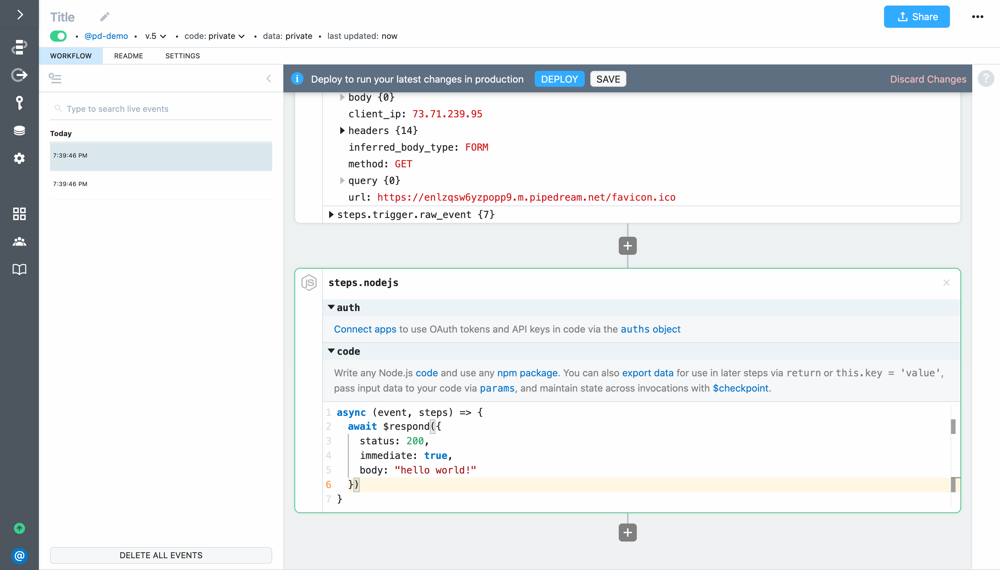
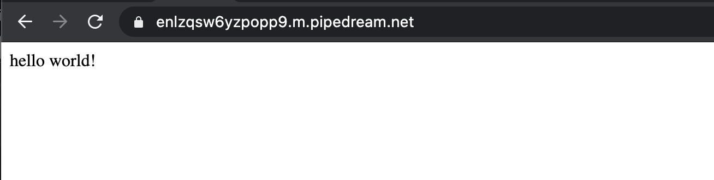

# hello world!

In this first example, we'll create an HTTP triggered workflow that will return a custom response on each HTTP request.

First, create a new workflow by clicking the **New** button on https://pipedream.com/workflows:


Pipedream will launch the workfow builder:


Following is a map and explanation of the screen layout:


**Pipedream Navigation:** Navigate between different sections of the Pipedream app (workflows, sources, accounts, settings, etc). You can collapse and expand this section using the arrow at the top left.

**Workflow Header:** Name your workflow, view metadata and manage sharing settings.

**Event List:** Events that trigger your workflow will be listed here (both test and live events). Select events to view the results of the execution in the *Workflow Builder* section.

**Canvas**: This is the section where you will build your workflow and view execution resuts.

**Workflow Tabs**: After saving or depoying your workflow, you will be able to switch between the builder, readme and settings for your workflow.

**Contextual Help**: Expand this tab to view contextual help for the current step.

To create an HTTP or webhook triggered workflow, select the **HTTP API** trigger. 


Your workflow will automatically deploy and Pipedream will generate a unique endpiont URL.


Any requests you make to the endpoint URL will trigger your workflow. To test it out:

1. Copy the endpoint URL generated by Pipedream (you can click to link icon to the right of the endpoint to copy to the clipboard)
2. Open a new browser tab and load the URL


When you return to your workflow, you'll see the requests appear in the event list (events appear in real-time — you don't need to refresh the page). 

>  **NOTE:** When you look at the event list, you may see multiple requests — that's because modern browsers automatically request `favicon.ico` when you load a URL.


When you select an event from the list, the data associated with that event will appear below each of the steps in your workflow. For the trigger, that means details related to the inbound request (e.g., URL, HTTP method, body, headers, etc) will appear. This data can also be referenced by steps in your workflow via the `steps` object. For example, to reference the HTTP body, you would access via `steps.trigger.event.body`.

![[video-to-gif output image]](https://im2.ezgif.com/tmp/ezgif-2-a8d29ac088cc.gif)

Let's write some simple code to return a custom response using Pipedream's `$respond()` function. First, click on **Run Node.js code** to add a code step.

 

Pipedream will add a code step to your workflow. 


You can write any Node.js and include any npm package (just `require` it — there's no `npm install` required). For this example, add the following code to return a custom response:

```javascript
await $respond({
  status: 200,
  immediate: true,
  body: "hello world!"
})
```



Then click the deploy button so your workflow changes will run in production on each new event:


Then reload the tab where you previously loaded the endpoint URL — you the response should change to `hello world!`.



Congratulations! You've built your first serverless workflow!
