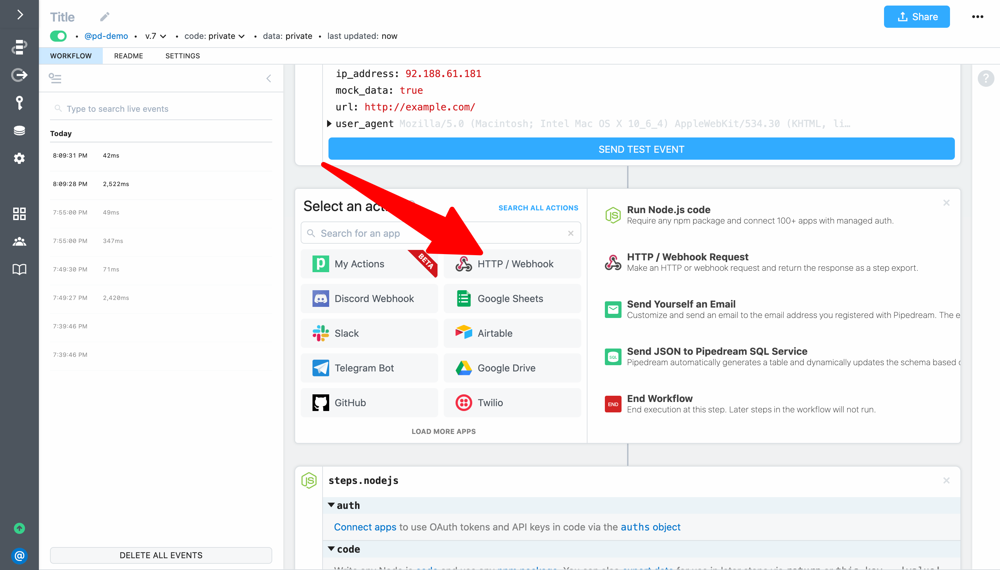
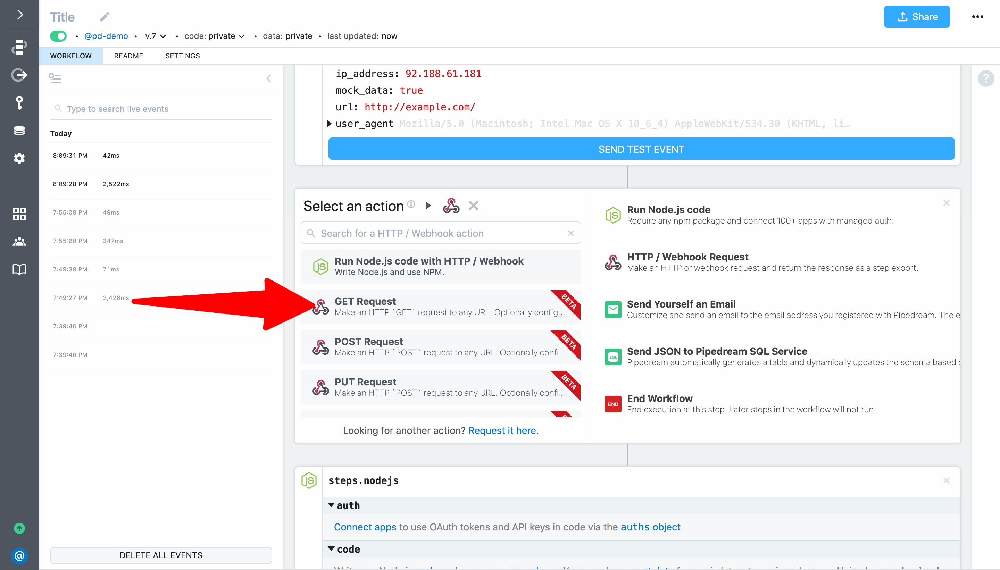
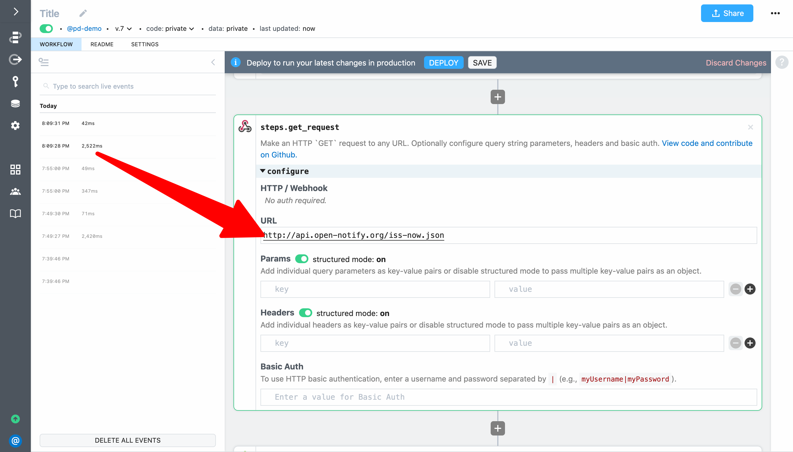
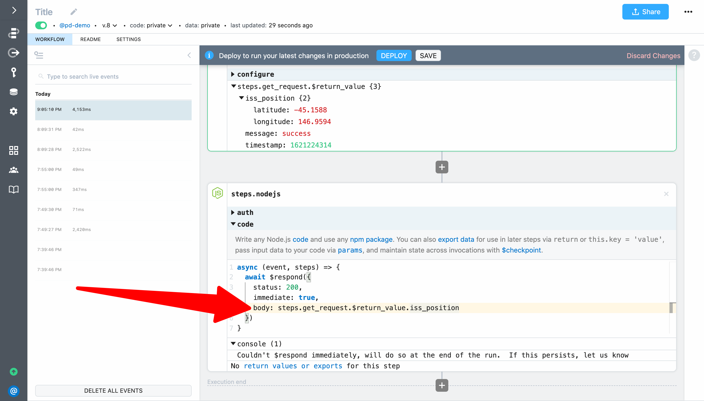

# Make outbound HTTP requests

In the previous examples, we focused on catching inbound HTTP requests and manipulating the response. Next, we'll use an action step to make an outbound request from our workflow. 

This example will take  **2 - 3 minutes** and will cover how to:

- Use the **GET Request** action to make an HTTP request from your workflow
- Test the workflow and inspect the step exports
- Return data exported by the **GET Request** step in the custom HTTP response

First, click on the **+** sign between the trigger and code steps to bring up the step menu.


Next, click on the **HTTP / Webhook** app:



Then select **GET Request** (to make an HTTP `GET` request):



Next, enter `http://api.open-notify.org/iss-now.json` as the URL. This URL is a free API provided by open-notify.org  to return the current position of the International Space Station (ISS). It does not require any authentication.



Finally, click **Deploy** and then hit the **Send Test Event** button in the trigger to run the workflow so we can test our change (we don't need to make a live request from our web browser since we're not validating the workflow response with this test).


Select the event that's generated on the in the event list to inspect the execution. The response from the **GET Request** action is exported as `steps.get_request.$return_value` (exported data can be referenced in future steps). Expand the `iss_position` key to see the `lattitude` and `longitude` returned by the API. If you run the workflow again, you'll see the position change for each execution:


Next, update the response to return the `lattitude` and `longitude` returned by the API as the HTTP response for the workflow. To do that, replace the current value for the `body` parameter in the `$respond()` function and set it to `steps.get_request.$return_value.iss_position` (with no quotes or backticks):

```javascript
await $respond({
  status: 200,
  immediate: true,
  body: steps.get_request.$return_value.iss_position
})
```



Finally, click **Deploy** and then reload the URL in your web browser.`hello foo!` should be replaced by the JSON representing the ISS position. Each time you load the URL, the updated position will be returned.


**Next, we'll replace the GET Request action with a code step and use the `axios` npm package to get the ISS position.** [Take me to the next example &rarr;](../using-npm-packages/) 

