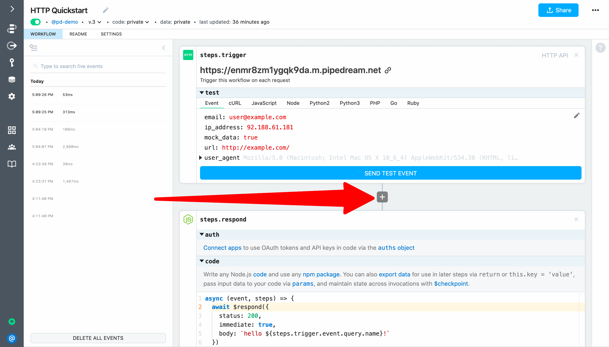
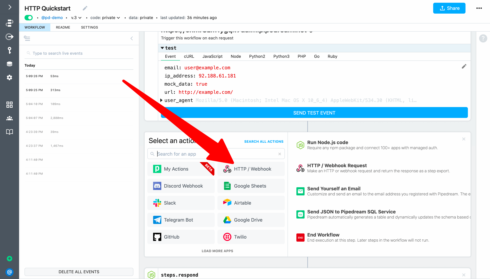
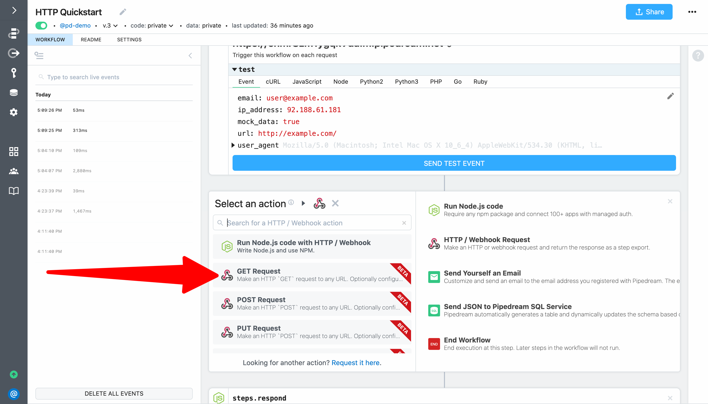
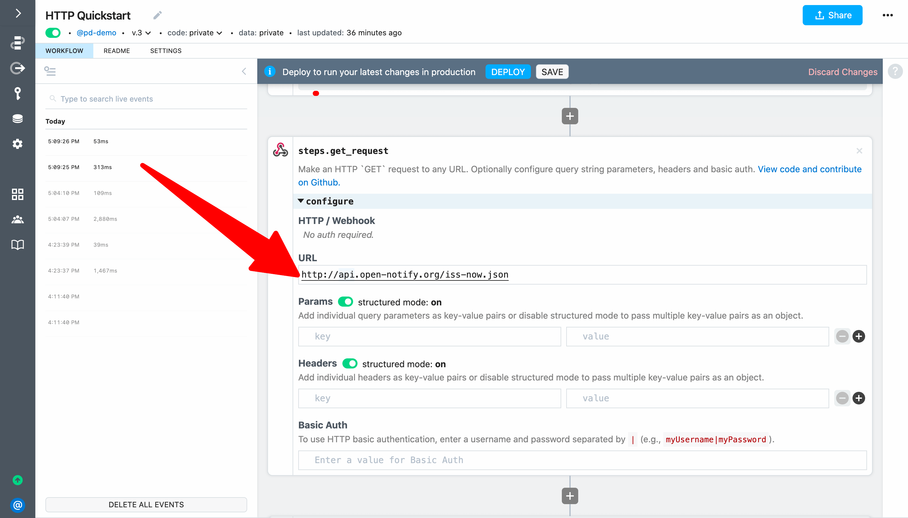
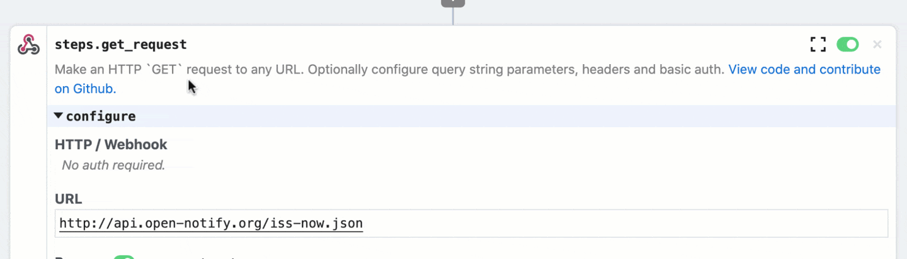
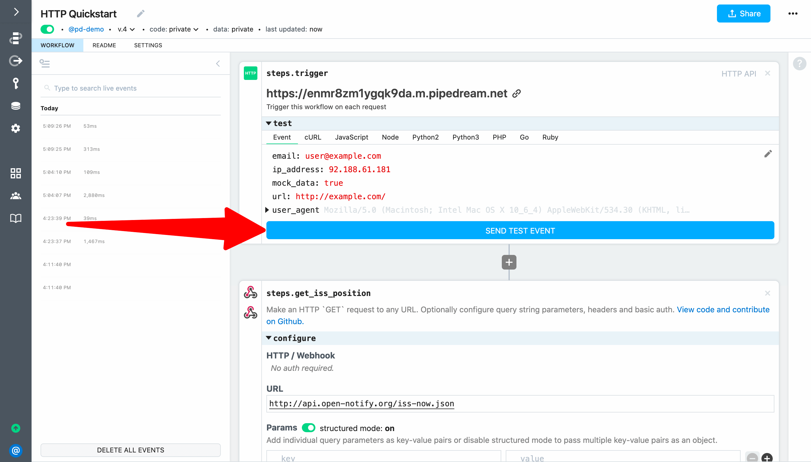
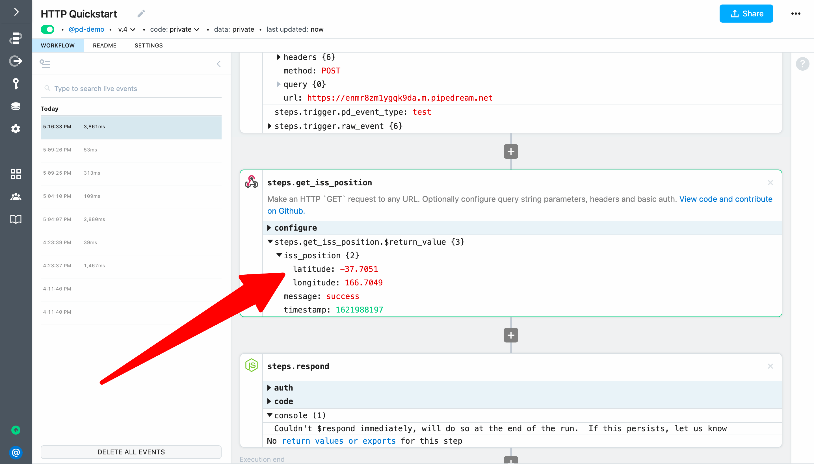
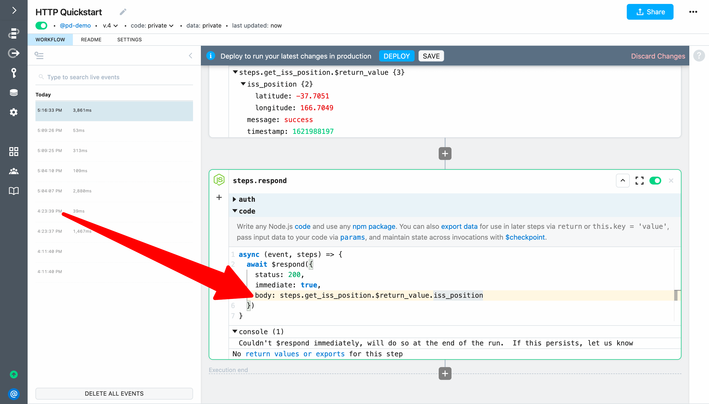
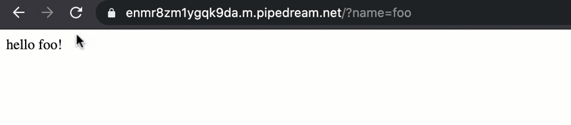
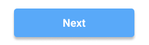

# Make outbound HTTP requests

In the previous examples, we focused on catching inbound HTTP requests and manipulating the workflow response. Next, let's add an action step to make an outbound request from our workflow — we'll get data from a simple HTTP API and return the response from our workflow. This example builds on the workflow created in [previous sections](/quickstart/) and will cover how to:

[[toc]]

::: tip
If you didn't complete the previous examples, we recommend you start from the [beginning of this guide](/quickstart/). If you still want to start here, [copy this workflow](https://pipedream.com/@gettingstarted/quickstart-hello-name-p_WxCqxbR) and then follow the instructions below. If you have any issues completing this example, you can [view, copy and run a completed version](https://pipedream.com/@gettingstarted/quickstart-make-outbound-http-requests-p_6lCQOLo).
:::

### Use a pre-built action to make an HTTP request from your workflow

First, click on the **+** sign between the two steps to open the step menu.



Next, select the **HTTP / Webhook** app:



Then select the **GET Request** action (to make an HTTP `GET` request):



Next, enter `http://api.open-notify.org/iss-now.json` in the **URL** field. This URL is a free API provided by open-notify.org  to return the current position of the International Space Station (ISS). It does not require any authentication.



Then, update the step name from `steps.get_request` to `steps.get_iss_position`. **This is important — if you don't update the name, the updates below that use data exported by this step will fail.**



Finally, click **Deploy** and then hit the **Send Test Event** button in the trigger to run the workflow so we can test our change (we don't need to make a live request from our web browser since we're not validating the workflow response with this test).



### Inspect the exports for the action step

Select the new event from the list to inspect the execution. The response from the **GET Request** action should be exported as `steps.get_iss_position.$return_value`. Expand the `iss_position` key to inspect the `latitude` and `longitude` returned by the API. If you run the workflow again, you'll see the position change for each execution:



### Use data exported by the action in the workflow response

Next, update `$respond()` in `steps.respond` to return `steps.get_iss_position.$return_value.iss_position` as the body of the workflow response:

```javascript
await $respond({
  status: 200,
  immediate: true,
  body: steps.get_iss_position.$return_value.iss_position
})
```



Finally, **Deploy** and reload the endpoint for your workflow in your web browser. `hello foo!` should be replaced by the JSON representing the ISS position. Each time you load the endpoint the most recent position will be returned.



::: tip
If you get an error, make sure you renamed the **GET Request** action to `steps.get_iss_position`
:::

**Next, let's replace the GET Request action with a code step and use the `axios` npm package to get the position of the ISS.** 

<p style="text-align:center;">
<a :href="$withBase('/quickstart/using-npm-packages/')"></a>
</p>