# Real-world Twitter -> Slack

For the last example in this quickstart, we'll use many of the patterns introduced in [earlier examples](/quickstart/) to solve a real-world use case and will cover how to:

- [Trigger a workflow anytime @pipedream is mentioned on Twitter](#trigger-a-workflow-anytime-pipedream-https-twitter-com-pipedream-is-mentioned-on-twitter)
- [Construct a message in Node.js using Slack Block Kit](#construct-a-message-in-node-js-using-slack-block-kit)
- [Use an action to post the formatted message to a Slack channel](#use-an-action-to-post-the-formatted-message-to-a-slack-channel)
- [Run a live test](#run-a-live-test)

Following is an example of a Tweet that we'll richly format and post to Slack:


::: tip
If you didn't complete the previous examples, we recommend you start from the [beginning of this guide](/quickstart/) to learn the basics of workflow development. If you have any issues completing this example, you can [view, copy and run a completed version](https://pipedream.com/@gettingstarted/quickstart-real-world-twitter-slack-p_n1Co2dO).
:::

### Trigger a workflow anytime [`@pipedream`](https://twitter.com/pipedream) is mentioned on Twitter

First, create a new workflow and select the **Twitter** app:


Select **Search Mentions** to trigger your workflow every time a new Tweet matches your search criteria:

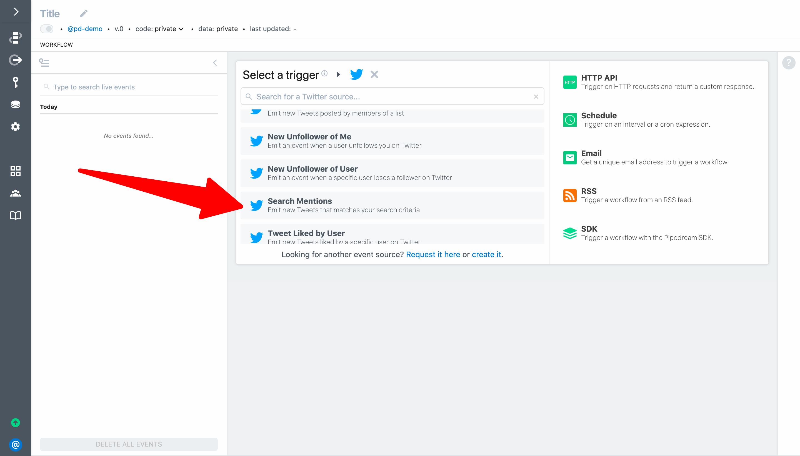

Connect your Twitter account and then enter `@pipedream` for the search term. This will trigger your workflow when Pipedream's handle is mentioned on Twitter.

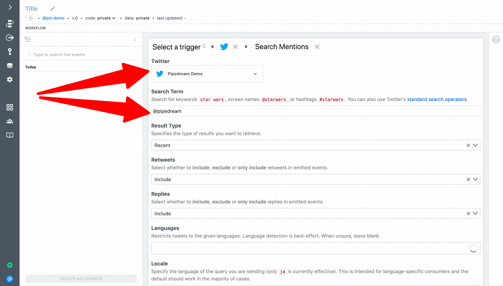

To complete the trigger setup, add an optional name (e.g., `Pipedream Mentions`) and click **Create Source**:

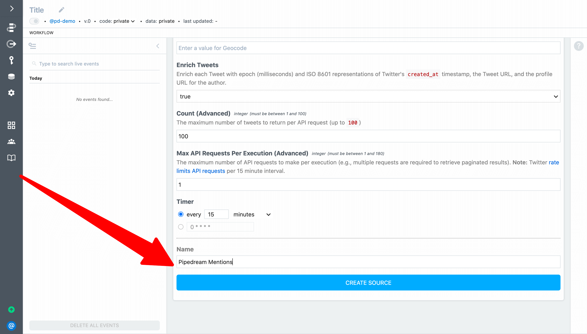

Use the drop-down menu to select the event to help you build your workflow. Here we've selected a recent Tweet that includes an image (so we can incorporate that into our Slack message).

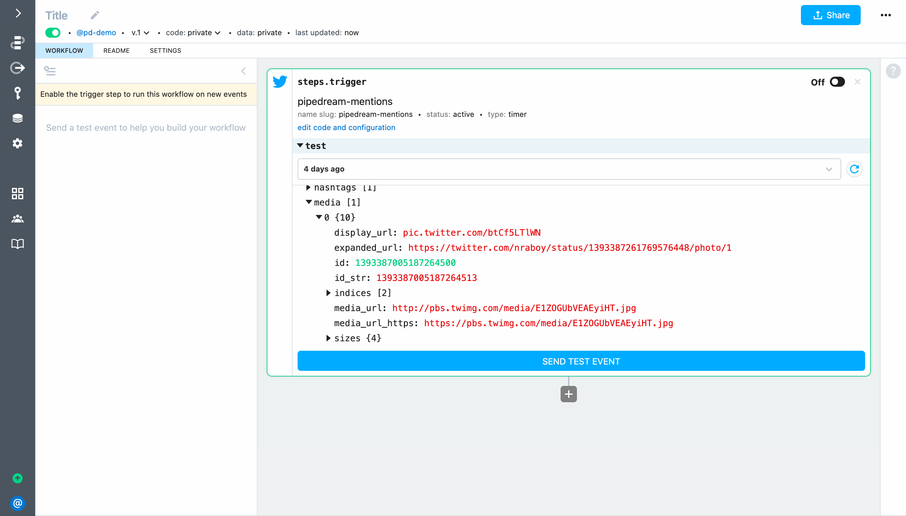

### Construct a message in Node.js using Slack Block Kit

Let's include the following data from the trigger event in our Slack message:

- Tweet text
- Tweet Language
- Tweet URL
- Image (if the Tweet included an image, video or animated GIF)
- Tweet timestamp
- Screen name and profile picture of the user
- Metadata for the user (number of followers, location and description)
- Link to the workflow that generated the Slack message (so it's easy to get to if we need to make changes in the future)

We can use Slack's Block Kit Builder to create a [JSON message template with placeholder values](https://app.slack.com/block-kit-builder/TD5JFTFRQ#%7B%22blocks%22:%5B%7B%22type%22:%22section%22,%22text%22:%7B%22type%22:%22mrkdwn%22,%22text%22:%22*%3Chttps://twitter.com/nraboy/statuses/1392985537083019267%7CNew%20Mention%3E%20by%20%3Chttps://twitter.com/nraboy/%7Cnraboy%3E%20(Thu%20May%2013%2023:30:07%20+0000%202021):*%5Cn%3E%20Tomorrow%20(05/14)%20at%207PM%20PT,%20we%20have%20a%20serverless%20filled%20night%20at%20the%20Tracy%20Developer%20Meetup.%20RSVP%20to%20participate%20and%20learn%20from%20the%20one%20and%20only%20Raymond%20Camden!%20https://t.co/FFXBRemv5s%20cc%20@raymondcamden%20@pipedream%20@workvine209%20https://t.co/gYLut18lqC%5Cn%22%7D,%22accessory%22:%7B%22type%22:%22image%22,%22image_url%22:%22https://pbs.twimg.com/profile_images/1035554704988594178/stN0QpgC_normal.jpg%22,%22alt_text%22:%22Profile%20picture%22%7D%7D,%7B%22type%22:%22image%22,%22image_url%22:%22https://pbs.twimg.com/media/E1Tg9mAXMAEwFQF.jpg%22,%22alt_text%22:%22Tweet%20Image%22%7D,%7B%22type%22:%22context%22,%22elements%22:%5B%7B%22type%22:%22mrkdwn%22,%22text%22:%22*User:*%20nraboy%22%7D,%7B%22type%22:%22mrkdwn%22,%22text%22:%22*Followers:*%204.6k%22%7D,%7B%22type%22:%22mrkdwn%22,%22text%22:%22*Location:*%20Tracy,%20CA%22%7D,%7B%22type%22:%22mrkdwn%22,%22text%22:%22*Language:*%20English%20(en)%22%7D,%7B%22type%22:%22mrkdwn%22,%22text%22:%22*Description:*%20Pok%C3%A9mon%20Trainer%20%7C%20Developer%20Relations%20at%20@MongoDB%20%7C%20Author%20on%20The%20Polyglot%20Developer%20%7C%20Organizer%20of%20the%20Tracy%20Developer%20Meetup%20%7C%20@Mail_gun%20Maverick%22%7D%5D%7D,%7B%22type%22:%22actions%22,%22elements%22:%5B%7B%22type%22:%22button%22,%22text%22:%7B%22type%22:%22plain_text%22,%22text%22:%22View%20on%20Twitter%22,%22emoji%22:true%7D,%22url%22:%22https://twitter.com/nraboy/statuses/1392985537083019267%22%7D%5D%7D,%7B%22type%22:%22context%22,%22elements%22:%5B%7B%22type%22:%22mrkdwn%22,%22text%22:%22Sent%20via%20%3Chttps://pipedream.com/@/p_OKCYGM3%7CPipedream%3E%22%7D%5D%7D,%7B%22type%22:%22divider%22%7D%5D%7D). Next, we'll use a code step to replace the placeholder values with dynamic references to the event data that triggers the workflow.

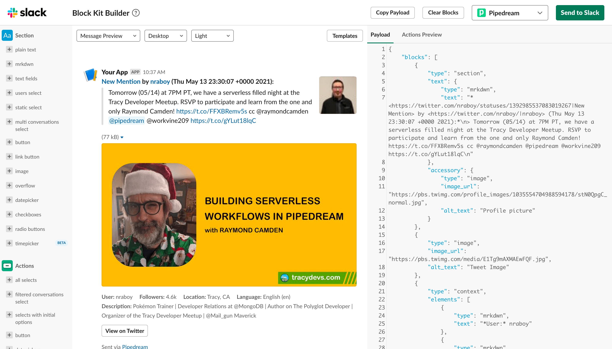

The action we will use accepts the array of blocks, so let's extract that and export a populated array from our code step (i.e., we don't need to generate the entire JSON payload).

Add a step to **Run Node.js code** and name it `steps.generate_slack_blocks`. 

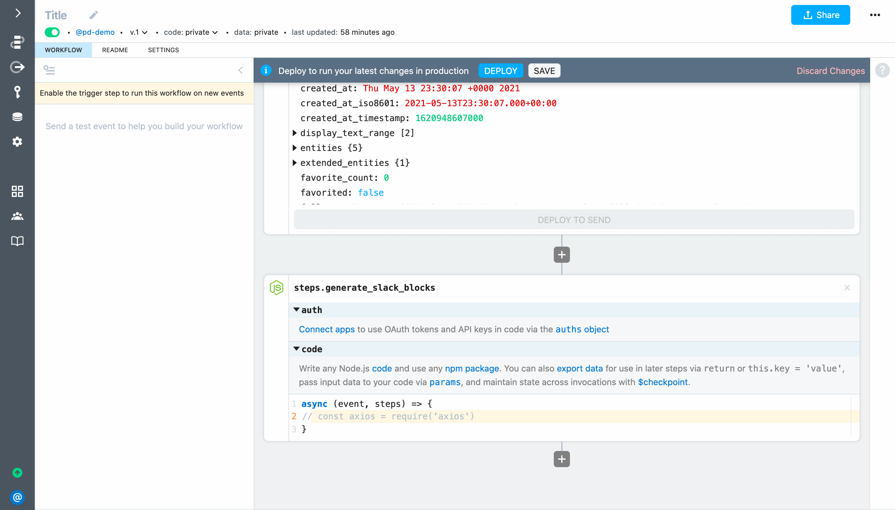

Next, add the following code to `steps.generate_slack_blocks`:

```javascript
// Require iso-639-1 to convert language codes into human readable names
const ISO6391 = require('iso-639-1')

// Require lodash to help extract values from intermittent fields in the Tweet object
const _ = require('lodash') 

// Function to return a friendly language name (or "Unknown") for ISO language codes
function getLanguageName(isocode) {
  try { return ISO6391.getName(isocode) } 
	catch (err) { return 'Unknown' }
}

// Function to format numbers over 1000 from Stack Overflow https://stackoverflow.com/questions/9461621/format-a-number-as-2-5k-if-a-thousand-or-more-otherwise-900
function kFormatter(num) {
    return Math.abs(num) > 999 ? Math.sign(num)*((Math.abs(num)/1000).toFixed(1)) + 'k' : Math.sign(num)*Math.abs(num)
}

// Format the Tweet (including line breaks) as a quoted Slack message
const quotedMessage = steps.trigger.event.full_text
	.split('\n')
	.map(line => `> ${line}`)
	.join('\n')

// Construct URLs to reference in the formatted message
const tweetUrl = `https://twitter.com/${steps.trigger.event.user.screen_name}/statuses/${steps.trigger.event.id_str}`
const userUrl = `https://twitter.com/${steps.trigger.event.user.screen_name}/`

/* 
Use lodash to get the URL for an image representing the media since 
this object is not always present; `trigger.event.entities` will be present
when media — photos, animated GIFs or videos — are attached to the Tweet. 
This object should always containt a photo, "even in cases of a video 
and GIF being attached to Tweet."
https://developer.twitter.com/en/docs/twitter-api/v1/data-dictionary/object-model/entities
*/
const mediaUrl = _.get(steps, 'trigger.event.entities.media[0].media_url_https')
const mediaType = _.get(steps, 'trigger.event.entities.media[0].type')

// Format the message as Slack blocks - https://api.slack.com/block-kit
const blocks = []
blocks.push({
	"type": "section",
	"text": {
		"type": "mrkdwn",
		"text": `*<${tweetUrl}|New Mention> by <${userUrl}|${steps.trigger.event.user.screen_name}> (${steps.trigger.event.created_at}):*\n${quotedMessage}`
	},
		"accessory": {
			"type": "image",
			"image_url": steps.trigger.event.user.profile_image_url_https,
			"alt_text": "Profile picture"
		}
})

console.log(mediaType)

// If the Tweet contains a photo add it to the message
if(mediaUrl && mediaType === 'photo') {
	blocks.push({
		"type": "image",
		"image_url": mediaUrl,
		"alt_text": "Tweet Image"
	})
}

// Populate the context elements, button and footer
blocks.push({
	"type": "context",
	"elements": [
		{
			"type": "mrkdwn",
			"text": `*User:* ${steps.trigger.event.user.screen_name}`
		},
		{
			"type": "mrkdwn",
			"text": `*Followers:* ${kFormatter(steps.trigger.event.user.followers_count)}`
		},
		{
			"type": "mrkdwn",
			"text": `*Location:* ${steps.trigger.event.user.location}`
		},
		{
			"type": "mrkdwn",
			"text": `*Language:* ${getLanguageName(steps.trigger.event.lang)} (${steps.trigger.event.lang})`
		},
		{
			"type": "mrkdwn",
			"text": `*Description:* ${steps.trigger.event.user.description}`
		}
	]
},
{
	"type": "actions",
	"elements": [
		{
			"type": "button",
			"text": {
				"type": "plain_text",
				"text": "View on Twitter",
				"emoji": true
			},
			"url": tweetUrl
		}
	]
},
{
	"type": "context",
	"elements": [
		{
			"type": "mrkdwn",
			"text": `Sent via <https://pipedream.com/@/${steps.trigger.context.workflow_id}|Pipedream>`
		}
	]
},
{
	"type": "divider"
})

return blocks
```

**Deploy** your workflow and send a test event. It should execute successfully and `steps.generate_slack_blocks` should return an array of Slack Blocks:

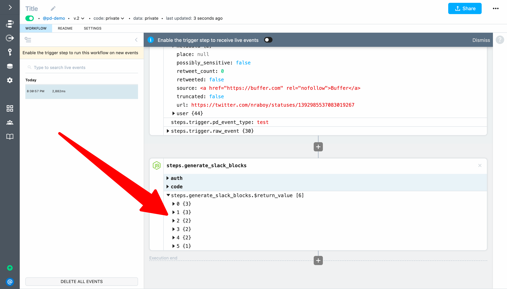

### Use an action to post the formatted message to a Slack channel

Next, click **+** to add a step and select the **Slack** app:

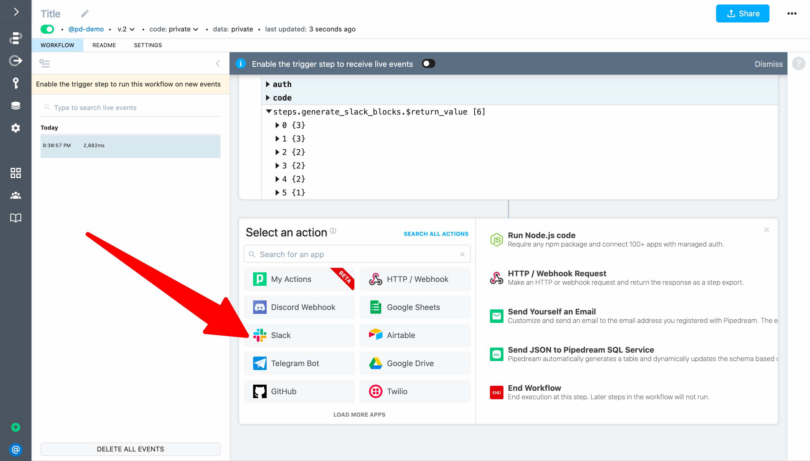

Then, scroll or search to find the **Send Message Using Block Kit** action:

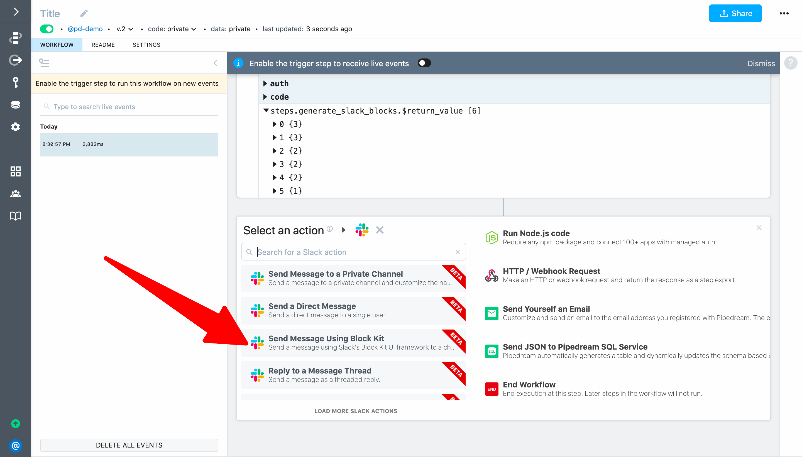

To configure the step:

1. Connect your Slack account
2. Select the channel where you want to post the message
3. Set the **Blocks** field to <code v-pre>{{steps.generate_slack_blocks.$return_value}}</code>
4. Set the **Notification Text** field to <code v-pre>{{steps.trigger.event.full_text}}</code> (if you don't provide **Notification Text**, Slack's new message alerts may be blank or may not work)

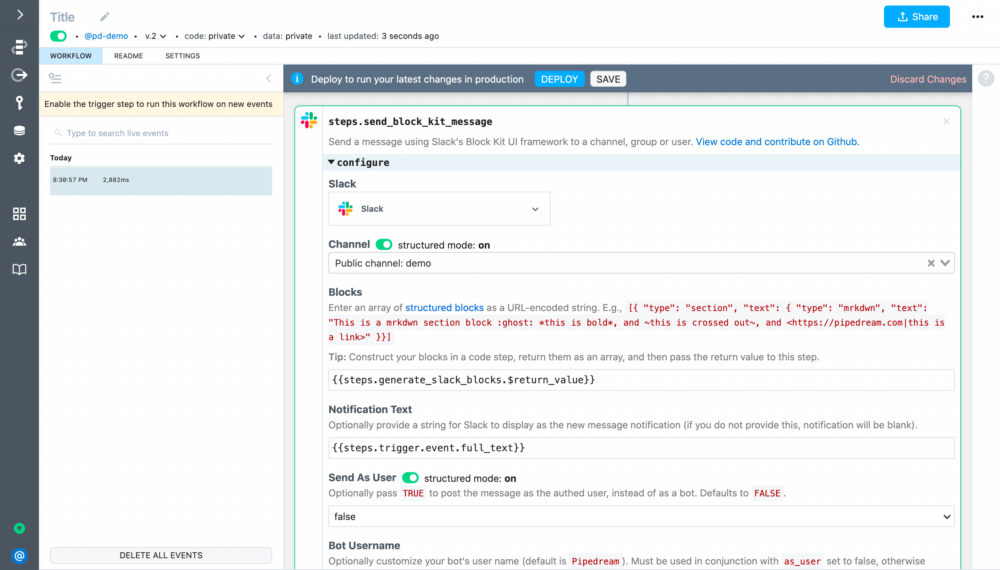

Then **Deploy** and send a test event to your workflow.

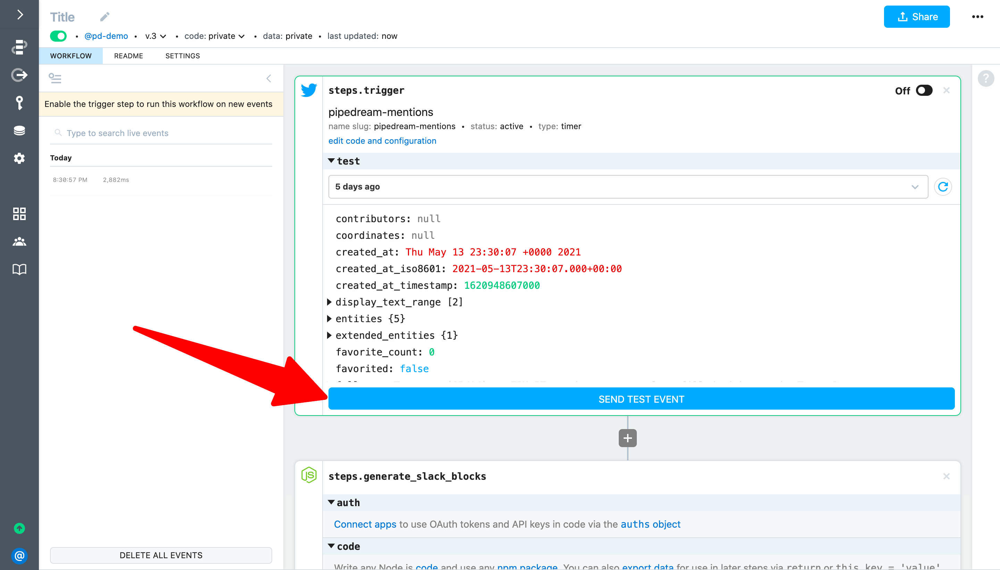

A formatted message should be posted to Slack:

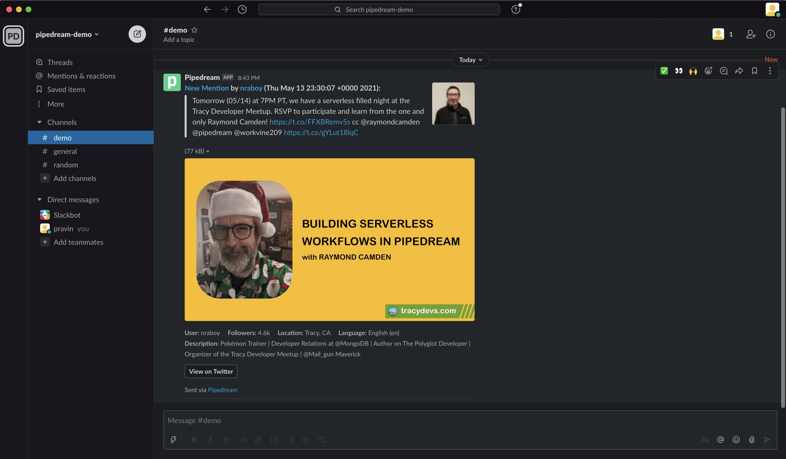

# Run a live test

To run a live test, first turn on your trigger to run the workflow on every new matching Tweet:

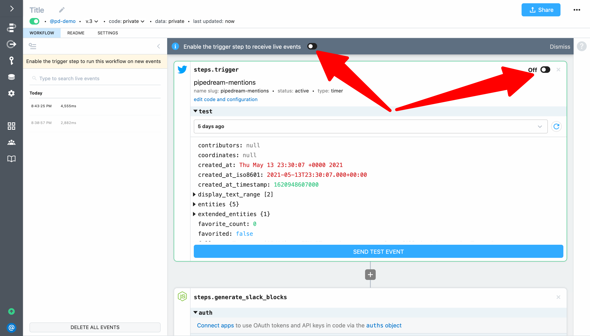

Next, post a Tweet mentioning `@pipedream` — **click Post Tweet below to use our pre-written Tweet with an image** (this image will be included in your formatted Slack message):

<p style="text-align:center;">
<a href="https://twitter.com/intent/tweet?text=I%27m%20testing%20my%20%40pipedream%20workflow!%20Try%20for%20free%20at%20https%3A%2F%2Fpipedream.com%2Fquickstart%2F%20and%20learn%20to%20connect%20APIs%20with%20code%20level%20control%20when%20you%20need%20it%2C%20and%20no%20code%20when%20you%20don%27t!%20pic.twitter.com%2F3kLOEdPMQ1" target="_blank"> 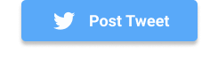</a>
</p>
<!--
 or [use our pre-written Tweet](https://twitter.com/intent/tweet?text=I%20just%20completed%20the%20%40pipedream%20quickstart!%20https%3A%2F%2Fpipedream.com%2Fquickstart%20).
<a href="https://twitter.com/intent/tweet?text=I%20just%20completed%20the%20%40pipedream%20quickstart!%20https%3A%2F%2Fpipedream.com%2Fquickstart%20" target="_blank">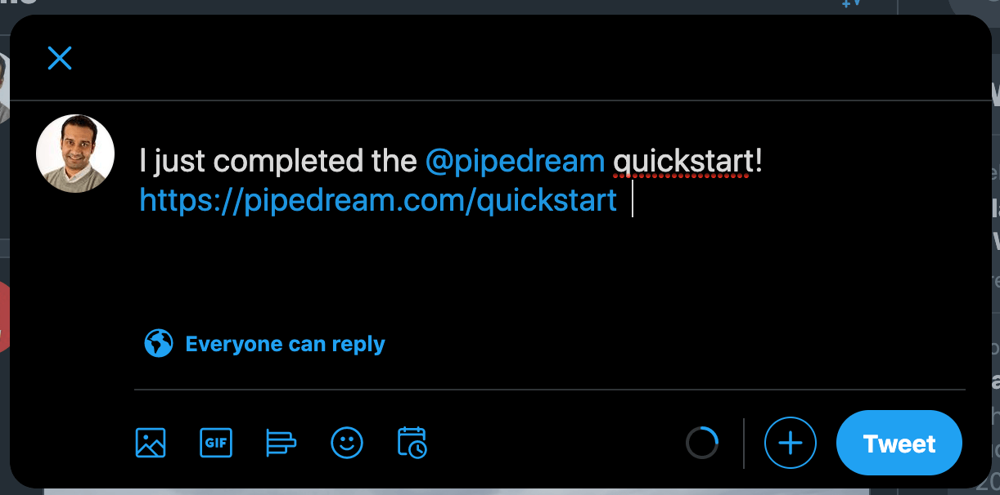</a>
-->

Your workflow will be triggered the next time the Twitter source runs (every 15 minutes by default). You can also trigger your source manually. Click on **Edit code and configuration** in your trigger step:

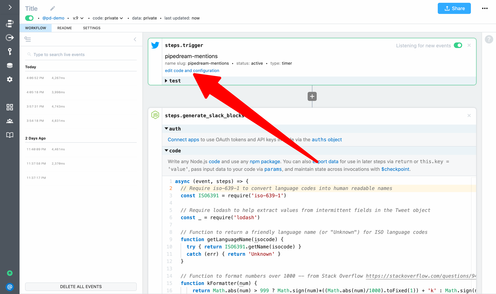

This will bring up the code and configuration for the source (which you can edit). Click on the **Events** tab:

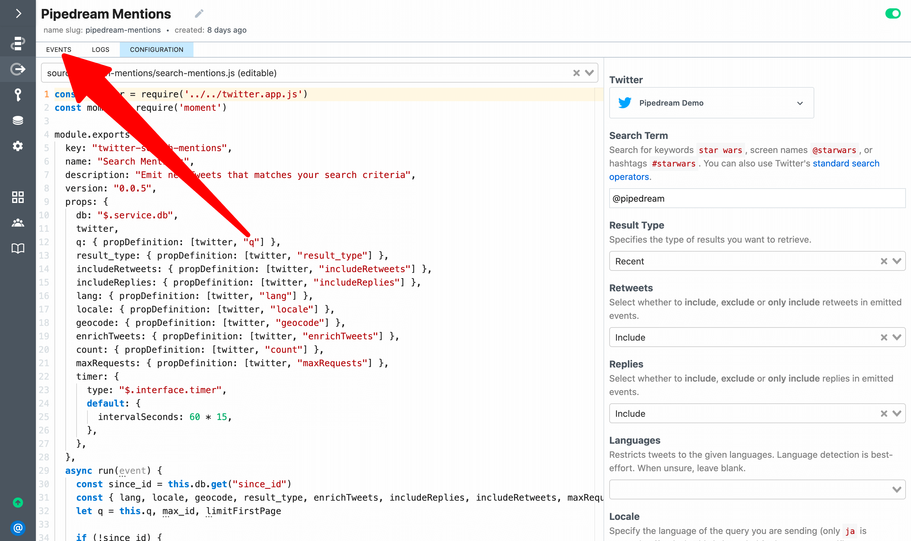

Finally, click on **Run Now**

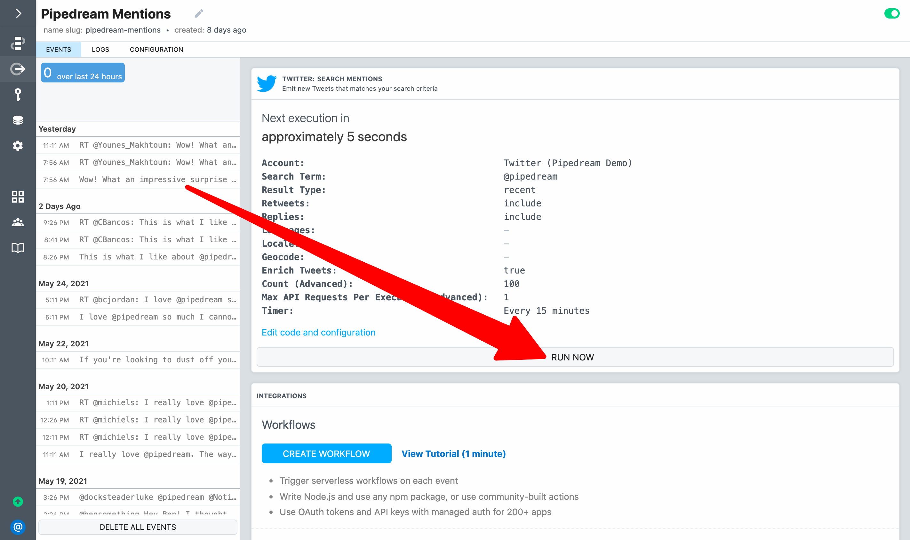

Your source will run and emit new Tweets. Each new Tweet will trigger your workflow. Messages should be posted to Slack, and you can return to the workflow to inspect the events.

**Congratulations! You completed the quickstart and you're ready to start building workflows on Pipedream!** Click **Next** to learn about Pipedream's advanced features including state management, concurrency and execution rate controls and more.

<p style="text-align:center;">
<a :href="$withBase('/quickstart/next-steps/')"></a>
</p>