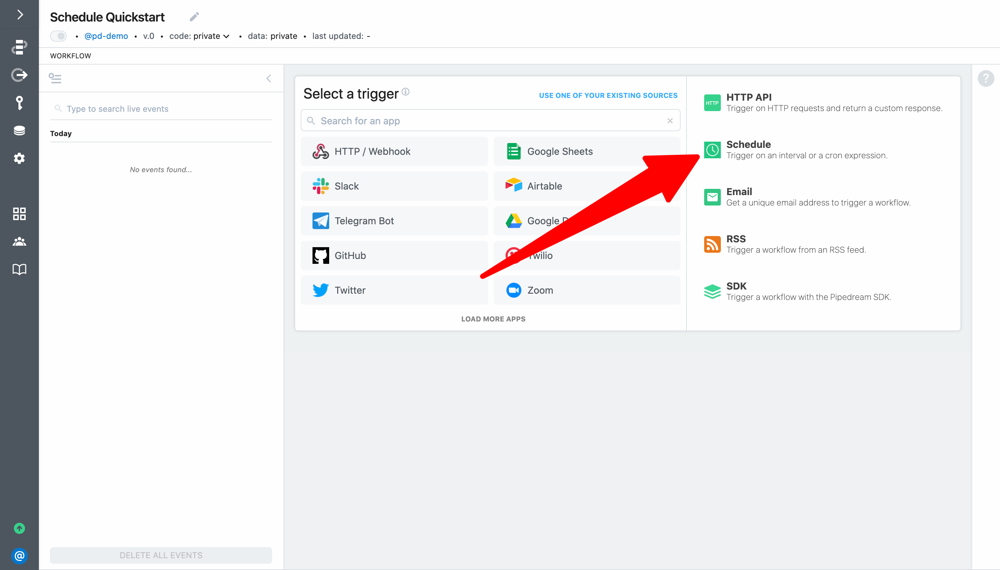
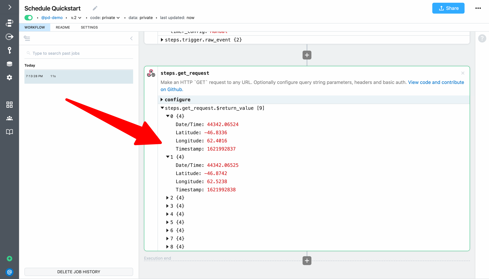

# Run workflow on a schedule

Next, let run a workflow on a schedule to keep our HTTP triggered workflow "warm". This example builds on the workflow created in [previous sections](/quickstart/hello-world/) and will cover how to:

[[toc]]

For context, it's common for serverless functions that have not been recently invoked to go "cold". "Cold" functions take about 500 milliseconds longer to run than "warm" functions. For many applications, this intermittent latency is insignificant. However, we'll demonstrate how to use a scheduled workflow to to keep our HTTP-triggered workflow "warm" by invoking it every 3 minutes. 

### Create a workflow using the schedule trigger

First, create a new workflow. Then name it `Schedule Quickstart` and select the **Schedule** trigger (we'll modify the HTTP triggered workflow in a moment, **so we recommend creating this workflow in a separate tab**):



Next, expand the step menu and select the **GET Request** action in the **HTTP / Webhook** app.


Enter the endpoint URL to trigger the workflow you built in the previous examples and add `/keepwarm` to the path (e.g., `https://YOUR-ENDPOINT-ID.m.pipedream.net/keepwarm`).


### Run a scheduled workflow manually to test it

Next, **Deploy** and click **Run Now** to test your workflow.


When you inspect the execution, you'll notice that `steps.get_request` returned an array of objects. That means the HTTP workflow ran end-to-end — including getting the latest ISS position and adding it to Google Sheets:



However, we don't want that to happen on our `/keepwarm` invocations. Let's fix that by adding a `$end()` statement to the HTTP workflow. 

Switch back to your HTTP triggered workflow, select the most recent event and expand `steps.trigger.raw_event`. The `uri` for the request should be `/keepwarm`. 


Let's use that field for our filter. When requests are made to the `/keepwarm` path, let's respond with an HTTP `204` no content response and end the workflow invocation.

```javascript
if(steps.trigger.raw_event.uri === '/keepwarm') {
  await $respond({
    status: 204,
    immediate: true,
  })
  $end("/keepwarm invocation")
}
```


**Deploy** the HTTP workflow, return to the scheduled workflow and click **Run Now** again. This time, no content should be returned from `steps.get_request`:


If you check the HTTP workflow, you should see the workflow execution ended at `steps.filter_keepwarm`:


### Configure a schedule

Finally, return to the scheduled workflow, configure it to run every 3 minutes, and **Deploy** to update trigger configuration:


Your scheduled workflow will now run every 3 minutes — 24 hours a day, 7 days a week.

**Next, we'll create a workflow using an app trigger to run a workflow every time there is a new item in an RSS feed.**

<p style="text-align:center;">
<a href="/quickstart/email-yourself/"></a>
</p>