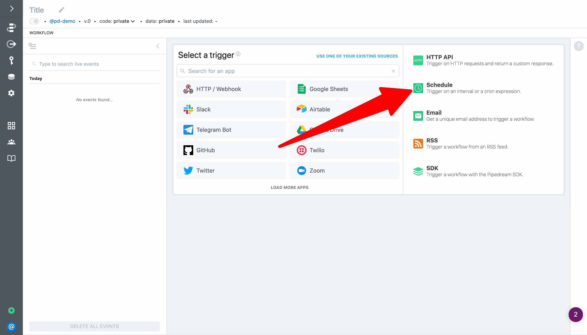
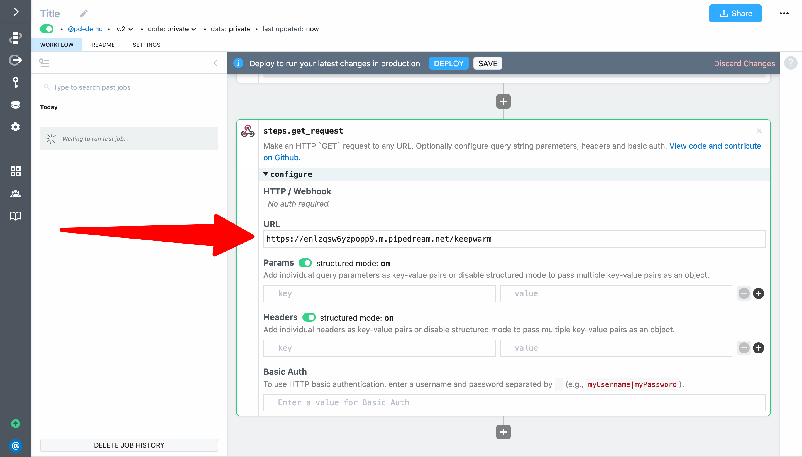
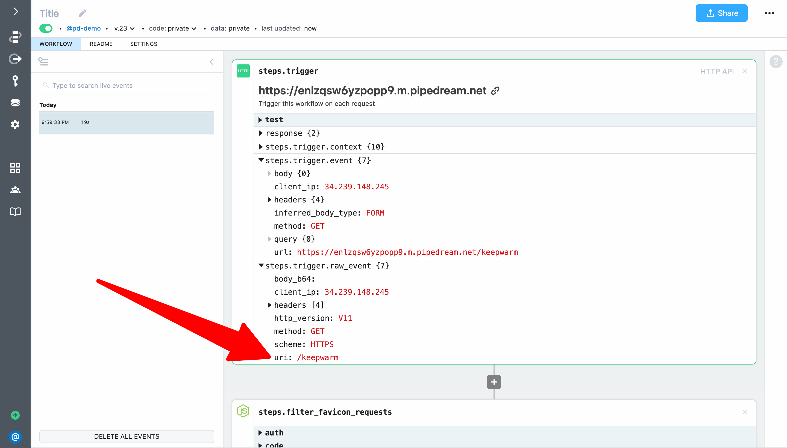
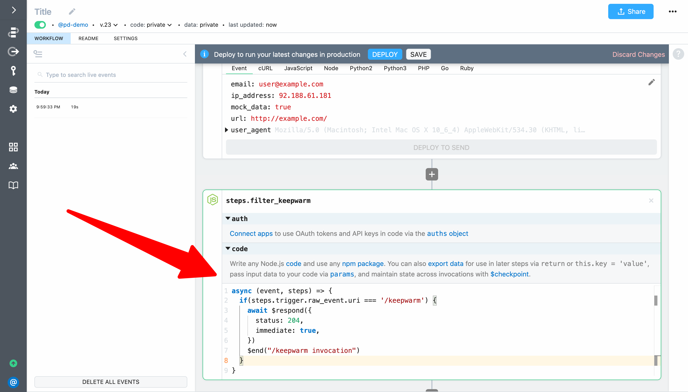
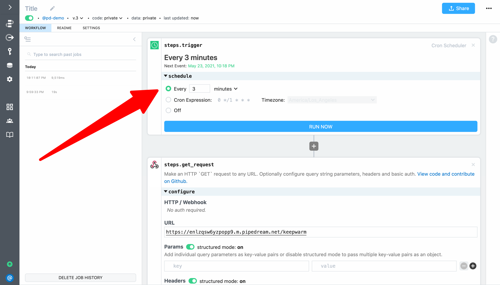

# Run workflow on a schedule

Next, let run a workflow on a schedule to keep our HTTP triggered workflow "warm". This example builds on the workflow created in [previous sections](/quickstart/hello-world/) and will cover how to:

1. Create a workflow using the schedule trigger
2. Run a scheduled workflow manually to test it
3. Configure a schedule

For context, it's common for serverless functions that have not been recently invoked to go "cold". "Cold" functions take about 500 milliseconds longer to run than "warm" functions. For many applications, this intermittent latency is insignificant. However, we'll demonstrate how to use a scheduled workflow to to keep our HTTP-triggered workflow "warm" by invoking it every 3 minutes. 

First, create a new workflow and select the **Schedule** trigger (we'll modify the HTTP triggered workflow in a moment, **so it's best to create this workflow in a separate tab**):



Next, add a step, select the **HTTP / Webhook** app and the **GET Request** action.


Enter the endpoint URL for the workflow you built in the previous examples and add `/keepwarm` to the path (e.g., `https://YOUR-ENDPOINT-ID.m.pipedream.net/keepwarm`).



 Next, **Deploy** and click **Run Now** to test your workflow.


When it runs, you'll notice that `steps.get_request` returned an array of objects. That means the HTTP workflow ran end-to-end — including getting the latest ISS position and adding it to Google Sheets:


However, we don't want that to happen on our `/keepwarm` invocations. Let's fix that by adding a `$end()` statement to the HTTP workflow. 

Return to our HTTP triggered workflow, select the most recent event and expand `steps.trigger.raw_event`. The `uri` for the request should be `/keepwarm`. 



Let's use that field for our filter. When requests are made to the `/keepwarm` path, let's respond with an HTTP `204` no content response and end the workflow invocation.

```javascript
if(steps.trigger.raw_event.uri === '/keepwarm') {
  await $respond({
    status: 204,
    immediate: true,
  })
  $end("/keepwarm invocation")
}
```



**Deploy** the HTTP workflow, return to the scheduled workflow and click **Run Now** again. This time, no content should be returned from `steps.get_request`:


If you check the HTTP workflow, you should see the workflow execution ended at `steps.filter_keepwarm`:


Finally, return to the scheduled workflow, schedule it to run on an inverval of every 3 minutes, and **Deploy** to update the workflow:



Your scheduled workflow will now run every 3 minutes — 24 hours a day, 7 days a week.

**Next, we'll create a workflow using an app trigger to run a workflow every time there is a new item in an RSS feed.** [Take me to the next example &rarr;](../email-yourself/) 
