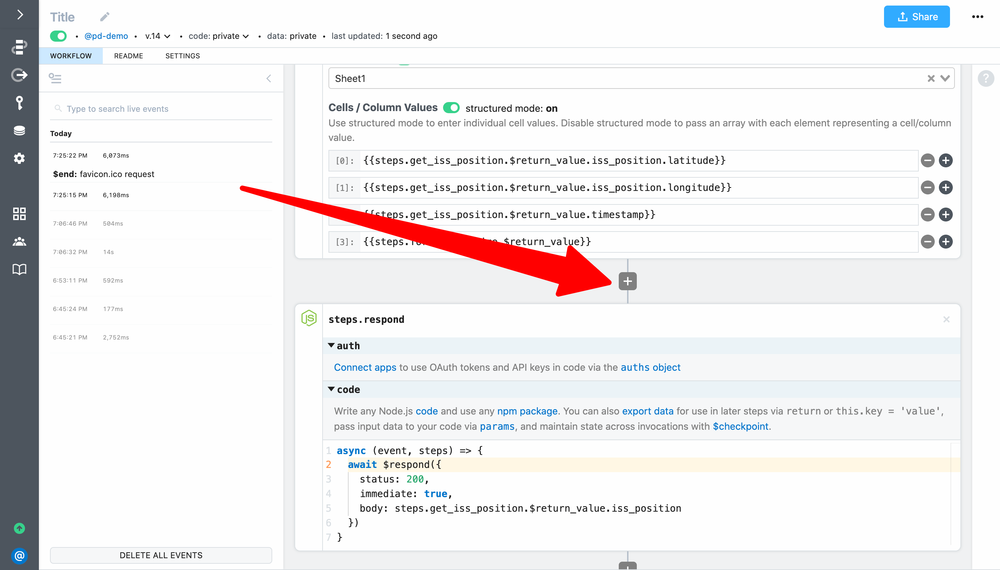
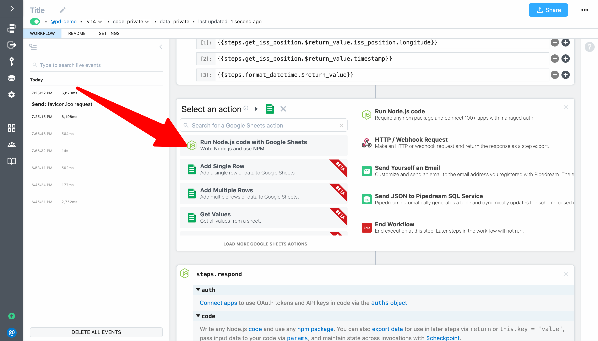
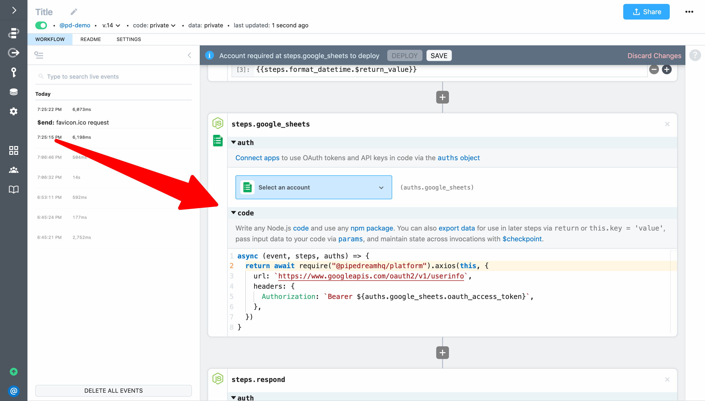
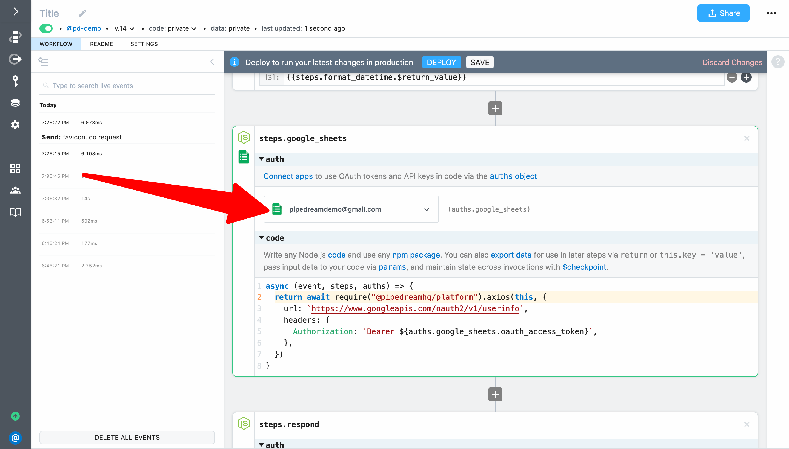
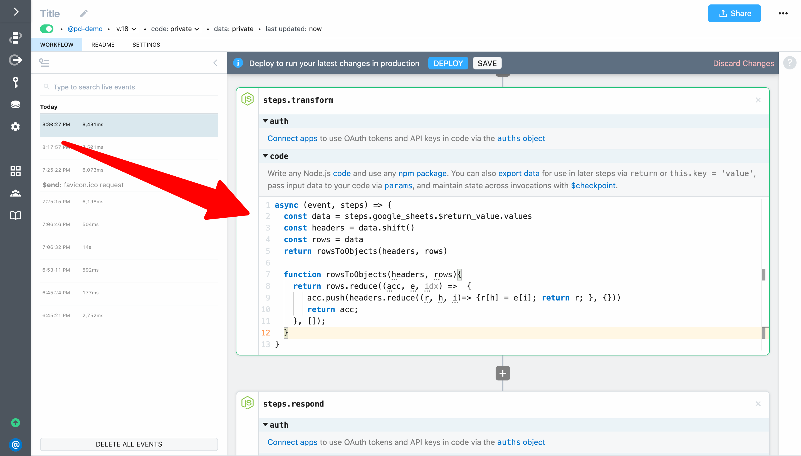
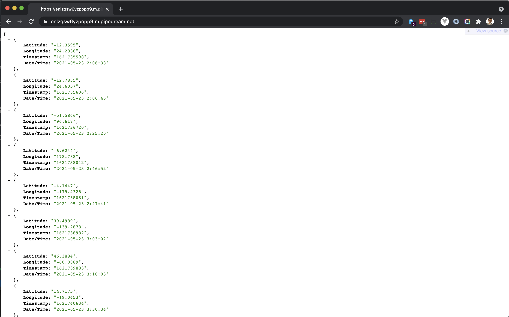

# Use managed auth in code

In the previous example, we used Pipedream managed auth in an action. You can also use the OAuth token or key you connect to Pipdream directly in code to authenticate your own API requests. Pipedream makes it easy by storing keys and tokens securely, and by managing the OAuth handshake and automatically refreshing the OAuth tokens behind the scenes.

For our next quickstart example, let's use Pipedream managed auth to connect to the Google Sheets API. 

First, expand the step selector right before `steps.respond`.



Select the **Google Sheet** app and selec the **Run Node.js with Google Sheets** action:



This will add a code step scaffolded to use the Google Sheets API. 



Select the account you used in the previous step (to save data to Google Sheets). We're going to retrieve data from that sheet in just a moment. 



That's all you need to do to use scaffolded code steps for most apps. To test it out, **Deploy** the workflow and **Replay** the last non-favicon event (since we're not focused on the response right now). Select the event and scroll to the step — you will see the results from Google's API exported from the step.


Next, let's customize the API request to get the data we want. Let's use it to get all the data points we added to Google Sheets so we can return them all in our workflow response. Since Pipedream exposes the standard Google API OAuth token, we can make any standard requests to the Google API so we just need to find the API endpoint we need in Google's docs. Based on the documentation at https://developers.google.com/sheets/api/reference/rest/v4/spreadsheets.values/get we need to make a `GET` request to `https://sheets.googleapis.com/v4/spreadsheets/{spreadsheetId}/values/{range}`. 


To do that, we simply need to modify the code that Pipedream scaffolded. First, replace the test URL of `https://www.googleapis.com/oauth2/v1/userinfo` with `https://sheets.googleapis.com/v4/spreadsheets/{spreadsheetId}/values/{range}`


Next, we need to replace `{spreadsheetId}` and `{range}` with values. You can get these manually, but since we added a row to Google Sheets, we can get this from the exports for `steps.add_single_row`. 


First, add a `$` before both `{spreadsheetId}` and `{range}` to convert the references to template literals (since the URL in enclosed in backticks, that allows us to write Node.js between the braces `{...}`). 

```javascript
return await require("@pipedreamhq/platform").axios(this, {
  url: `https://sheets.googleapis.com/v4/spreadsheets/${spreadsheetId}/values/${range}`,
  headers: {
    Authorization: `Bearer ${auths.google_sheets.oauth_access_token}`,
  },
})
```

Next, replace `spreadsheetId` with `steps.add_single_row.$return_value.spreadsheetId`. Then, since we want to get all the values in the sheet, let's use Javascript's `split()` function to replace `range` with the value to the left of the exclamation mark in `steps.add_single_row.$return_value.updatedRange` (i.e., we only want to pass the value `Sheet1`). Here's the final code for the step:

```javascript
return await require("@pipedreamhq/platform").axios(this, {
  url: `https://sheets.googleapis.com/v4/spreadsheets/${steps.add_single_row.$return_value.spreadsheetId}/values/${steps.add_single_row.$return_value.updatedRange.split("!")[0]}`,
  headers: {
    Authorization: `Bearer ${auths.google_sheets.oauth_access_token}`,
  },
})
```

And here is a screenshot of the step in the workflow:


When you're ready, **Deploy** and test your workflow again. If you select the event and expand the return value for `steps.google_sheets` you'll see the headers and data.


While we can update our response to return this data, let's add one last step to transform it from an array to an array objects, with each object containing key-values (using the header row for the keys). Since we can easily transform data using Node.js, we can write the code if we know it, or we can search Google for snippets that we can adapt. In this case, a quick Google Search turns up a [Stack Overflow post](https://stackoverflow.com/questions/58050534/javascript-make-a-key-value-data-structure-from-2-dimensional-arrayheader-row) with sample code that we can easily adapt.


Here is the code from the post:

```javascript
const headers = ['a', 'b', 'c'];
const rows = [[1, 2, 3], [4, 5, 6], [7, 8, 9]];
const result = rowsToObjects(headers, rows) 
console.log(result);
// [{a: 1, b: 2, c: 3}, {a: 4, b: 5, c: 6}, {a: 7, b: 8, c: 9}];

function rowsToObjects(headers, rows){
  return rows.reduce((acc, e, idx) =>  {
     acc.push(headers.reduce((r, h, i)=> {r[h] = e[i]; return r; }, {}))
     return acc;
  }, []);
}
```

Let's make the following modifications to that code snippet:

1. Set `headers` to the the first array element of `steps.google_sheets.$return_value.values`
2. Set `rows` to the remainder of the array (i.e., the elements with the data)
3. Return the result of `rowsToObjects(headers, rows) ` to export it from the step so we can reference it in our response
4. We can delete the `console.log` statement and the comment

Here's the updated code:

```javascript
const data = steps.google_sheets.$return_value.values
const headers = data.shift()
const rows = data
return rowsToObjects(headers, rows) 

function rowsToObjects(headers, rows){
  return rows.reduce((acc, e, idx) =>  {
     acc.push(headers.reduce((r, h, i)=> {r[h] = e[i]; return r; }, {}))
     return acc;
  }, []);
}
```

Let's add a **Run Node.js code** step between `steps.google_sheets` and `steps.respond` and name it `steps.transform`. Then add the code above.



Then **Deploy** and test your workflow to validate the step returns the data you expect.


Finally, update `steps.respond` to return `steps.transform.$return_value` as the body of the HTTP response.

```javascript
await $respond({
  status: 200,
  immediate: true,
  body: steps.get_iss_position.$return_value.iss_position
})
```


Finally, deploy and load the endpoint URL for your workflow in a browser. You should see the data from Google Sheets with the positions you recorded for the ISS (including the most recent position recorded when you hit the endpoint) returned as your workflow response:



And this was all done without exposing any API keys on the client side.


First, create a new workflow with a **Schedule** trigger.


Next, click the **+** button and select the Github app:


This time, instead of selecting an action, select **Run Node.js with GitHub**:


Pipedream will add a code step scaffolded with a simple API request — you just need to connect your account, deploy the workflow, and run it. Click the **Connect GitHub** button and follow the steps in the popup window to connect your Github account:


When your account is connected, it will be listed for the step. **Deploy** your changes and click **Run Now**:


You will see the response from GitHub's API exported from the step.


Next, let's modify the code to create a repository named `Quickstart Test`. We can update the code based on GitHub's documentation for their REST API at https://docs.github.com/en/rest/reference/repos#create-a-repository-for-the-authenticated-user. Based on the documentation, we need to modify the URL path, change the method to `POST` and add a payload with a `name` parameter. Following is the updated code:

```javascript
return await require("@pipedreamhq/platform").axios(this, {
  url: `https://api.github.com/user/repos`,
  method: `post`,
  data: {
    name: `Quickstart Test`
  },
  headers: {
    Authorization: `Bearer ${auths.github.oauth_access_token}`,
  },
})
```

**Deploy** and run the workflow. When you inspect the return value for `steps.github` you should see the API response indicate the repo was created:


You can then go to GitHub to confirm the repo was created in your account:


