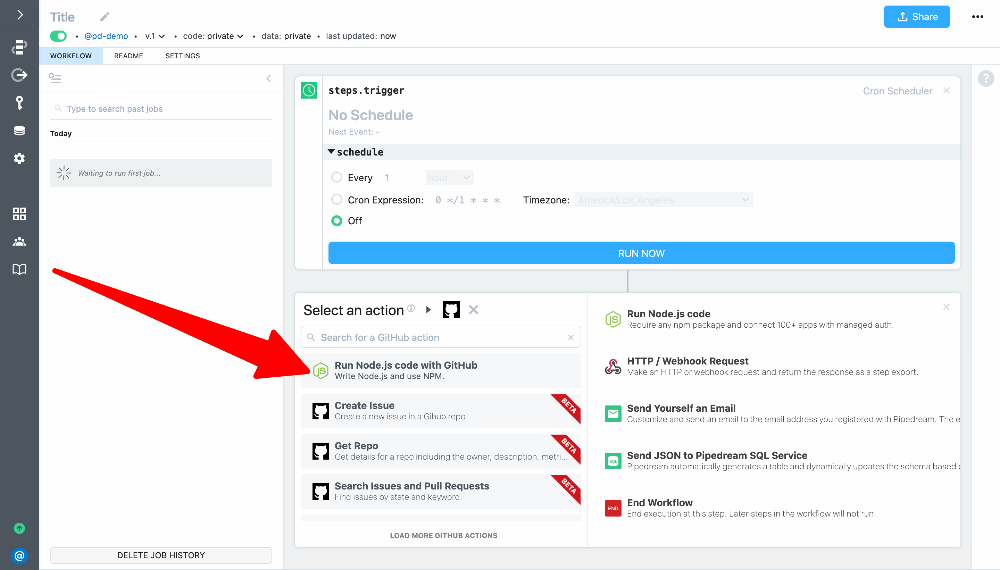
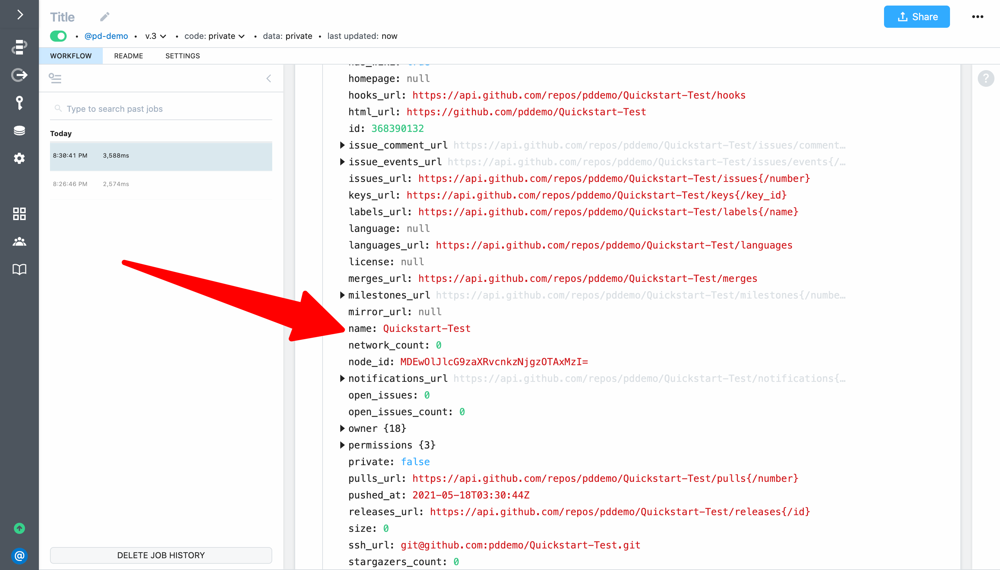
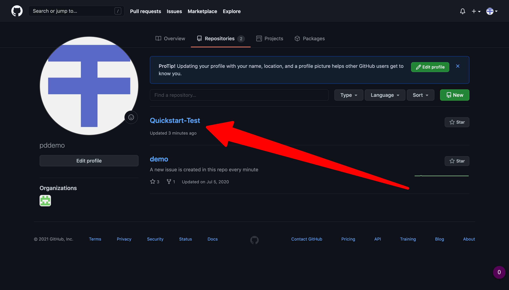

# Use managed auth in code

In the previous example, we used Pipedream managed auth in an action. You can also use the OAuth token or key you connect to Pipdream directly in code to authenticate your own API requests. Pipedream makes it easy by storing keys and tokens securely, and by managing the OAuth handshake and automatically refreshing the OAuth tokens behind the scenes.

For our last quickstart example, let's use Pipedream managed auth to connect to the Github API. First, create a new workflow with a **Schedule** trigger.


Next, click the **+** button and select the Github app:


This time, instead of selecting an action, select **Run Node.js with GitHub**:



Pipedream will add a code step scaffolded with a simple API request — you just need to connect your account, deploy the workflow, and run it. Click the **Connect GitHub** button and follow the steps in the popup window to connect your Github account:


When your account is connected, it will be listed for the step. **Deploy** your changes and click **Run Now**:


You will see the response from GitHub's API exported from the step.


Next, let's modify the code to create a repository named `Quickstart Test`. We can update the code based on GitHub's documentation for their REST API at https://docs.github.com/en/rest/reference/repos#create-a-repository-for-the-authenticated-user. Based on the documentation, we need to modify the URL path, change the method to `POST` and add a payload with a `name` parameter. Following is the updated code:

```javascript
return await require("@pipedreamhq/platform").axios(this, {
  url: `https://api.github.com/user/repos`,
  method: `post`,
  data: {
    name: `Quickstart Test`
  },
  headers: {
    Authorization: `Bearer ${auths.github.oauth_access_token}`,
  },
})
```

**Deploy** and run the workflow. When you inspect the return value for `steps.github` you should see the API response indicate the repo was created:



You can then go to GitHub to confirm the repo was created in your account:


