# Use connected accounts in code

In a previous example, we connected our Google Sheets account and used it in a no code action. In this example, let's use the same connected account to authenticate a Google Sheets API request in code to retrieve the full contents of our sheet. Then we'll transform the data and return it in our workflow response. This example builds on the workflow created in [previous sections](/quickstart/) and will cover how to:

[[toc]]

::: tip
If you didn't complete the previous examples, we recommend you start from the [beginning of this guide](/quickstart/). If you still want to start here, [copy this workflow](https://pipedream.com/@gettingstarted/quickstart-end-workflow-early-p_RRCgNRQ) and then follow the instructions below. If you have any issues completing this example, you can [view, copy and run a completed version](https://pipedream.com/@gettingstarted/quickstart-use-connected-accounts-in-code-p_ezCVLgy).
:::

### Scaffold an API request for an app in Node.js

First, expand the step selector right before `steps.respond`.


Select the **Google Sheet** app and select the **Run Node.js with Google Sheets** action:

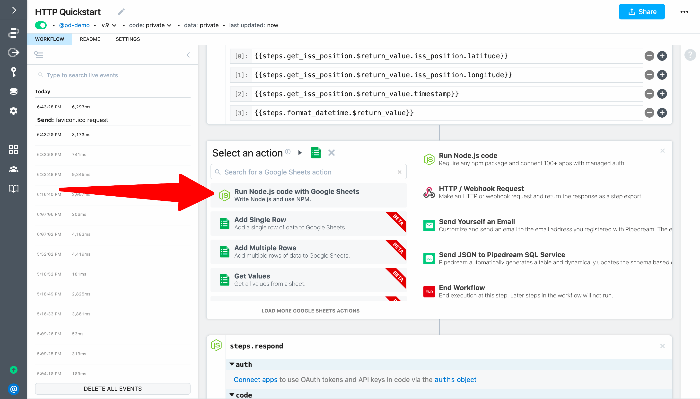

This will add a code step **scaffolded using Google Sheets' standard API together with Pipedream managed authentication** (so you can easily authenticate the API request using your connected account). 

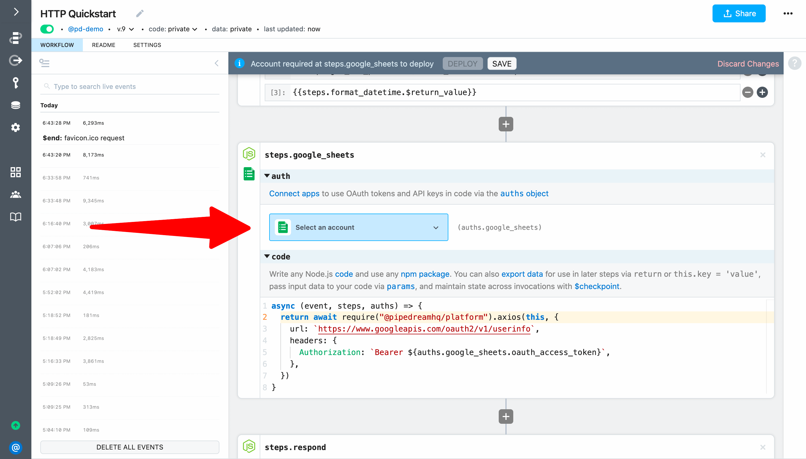

### Use a connected account in a code step
Next, let's test the scaffolded code. First, select the same account you used in the previous step (to save data to Google Sheets). It needs to be the same account because we're going to retrieve data from that sheet in just a moment. 

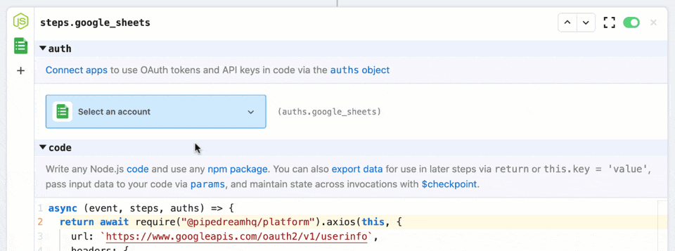

Then **Deploy** and test your workflow (either load the endpoint or click **Send Test Event**). Select an event that executed this step to inspect the exports — you should see the response from Google's `/userinfo` API.

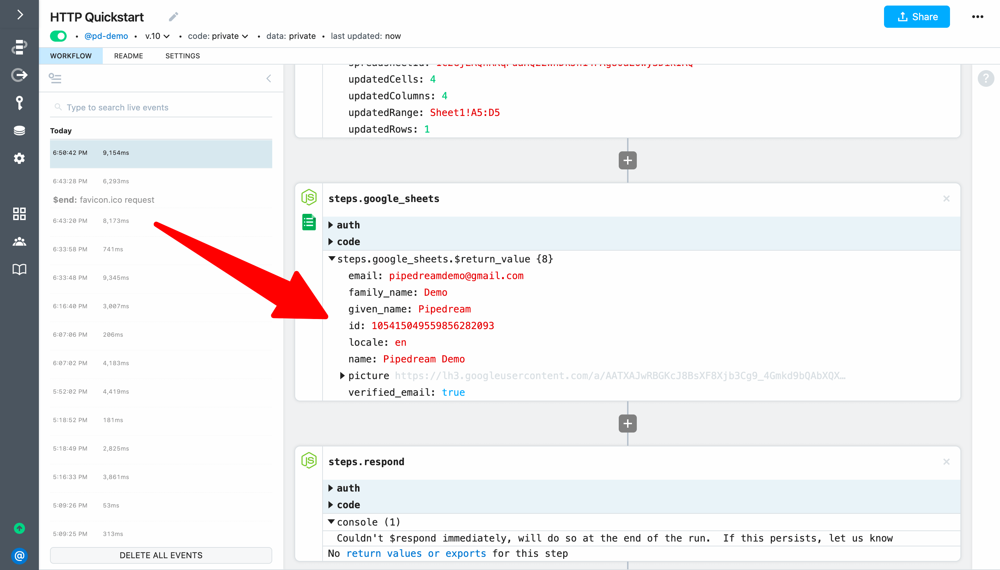

### Use standard API docs to customize scaffolded code

Next, let's customize the API request to retrieve all the ISS positions we added to Google Sheets in our previous tests so we can return them in our workflow response. Based on a quick Google search, we can find the details we need in [Google's developer documentation](https://developers.google.com/sheets/api/reference/rest/v4/spreadsheets.values/get). According to Google's docs, we need to make a `GET` request to `https://sheets.googleapis.com/v4/spreadsheets/{spreadsheetId}/values/{range}`. 

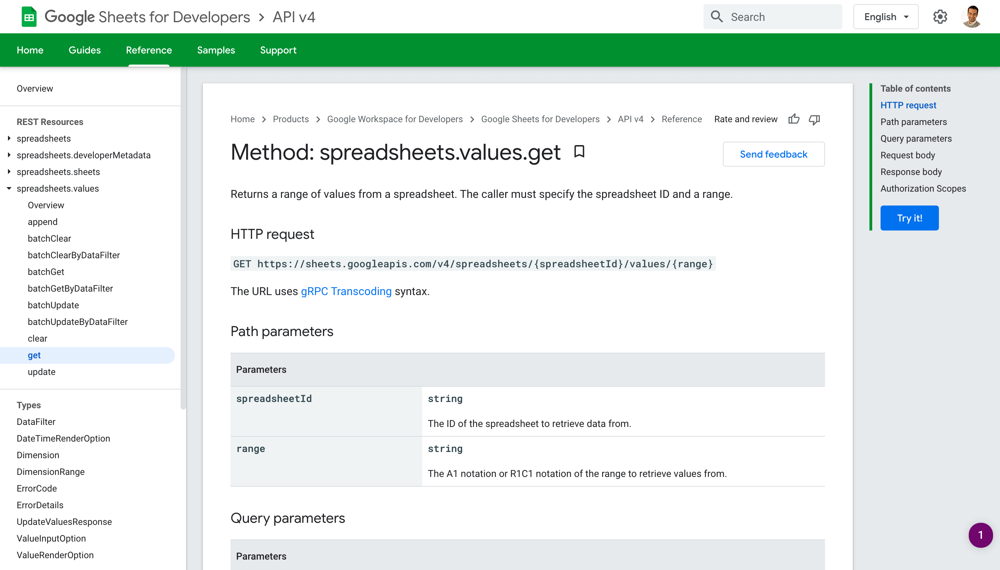

We need to replace the `url` in the scaffolded code, and we also need to modify the URL we found in Google's docs to pass real values for  `{spreadsheetId}` and `{range}`. Since we added a row to Google Sheets, we can get these values by referencing the exports for `steps.add_single_row`. 

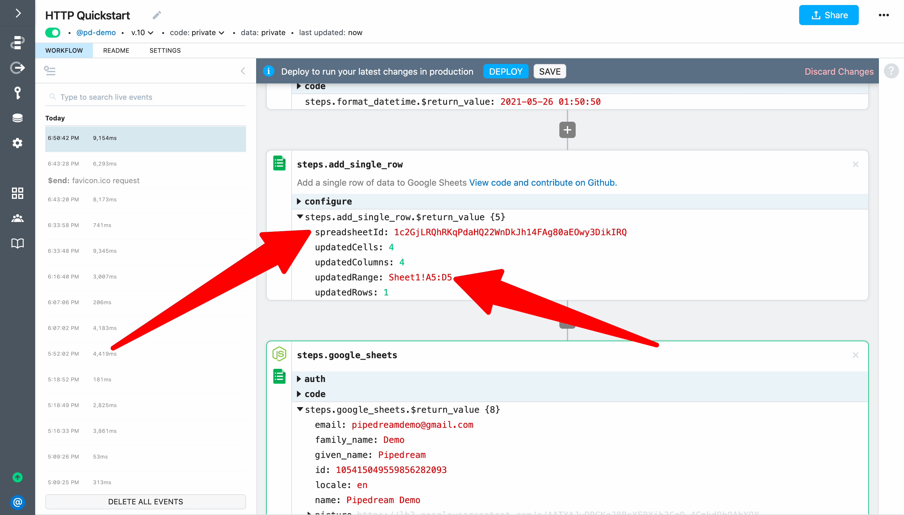

Here's the final code for the step that shows the udpated value for the `url` parameter (more details below):

```javascript
return await require("@pipedreamhq/platform").axios(this, {
  url: `https://sheets.googleapis.com/v4/spreadsheets/${steps.add_single_row.$return_value.spreadsheetId}/values/${steps.add_single_row.$return_value.updatedRange.split("!")[0]}`,
  headers: {
    Authorization: `Bearer ${auths.google_sheets.oauth_access_token}`,
  },
})
```

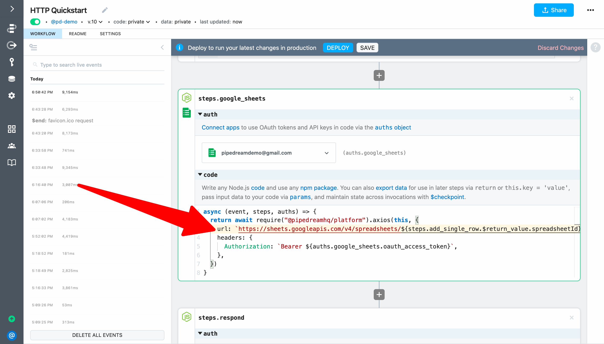

Here are more details about the changes we made in the code above (you can also skip this and move on to deploying and testing the update): 

1. Add a `$` before both `{spreadsheetId}` and `{range}` to convert the references to [template literals](https://developer.mozilla.org/en-US/docs/Web/JavaScript/Reference/Template_literals) (since the URL in enclosed in backticks, we can write code between `${...}`).  
2. Replace `spreadsheetId` with `steps.add_single_row.$return_value.spreadsheetId`. 
3. Since we want to get all the values in the sheet, we can use Javascript's `split()` function to replace `range` with the value to the left of the exclamation mark in `steps.add_single_row.$return_value.updatedRange` (i.e., we only want to pass the value `Sheet1`). To do that, we can reference `steps.add_single_row.$return_value.updatedRange.split("!")[0]`.

When you're ready, **Deploy** and test your workflow again. If you select the event and expand the return value for `steps.google_sheets` you'll see the headers and data from the Google Sheet.

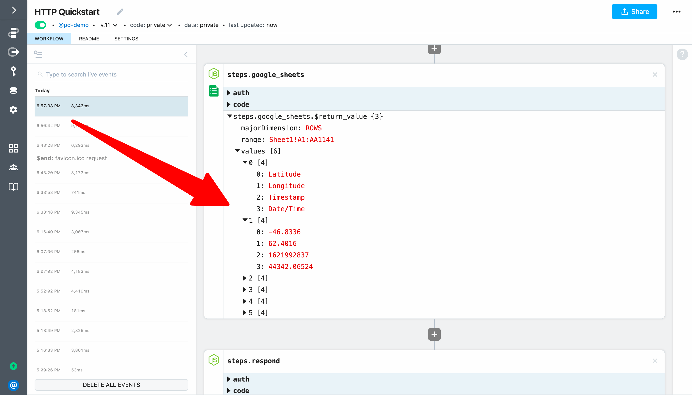

### Use a code snippet from Stack Overflow to transform the API response

While we can update our workflow response to return `steps.google_sheets.$return_value`, let's add one more code step to transform it from an array of arrays to an array of objects (using the header values for the keys). Since we can easily transform data using Node.js, we can write the code if we know it or we can search Google for snippets to adapt. In this case, a quick Google Search turns up a [Stack Overflow post](https://stackoverflow.com/questions/58050534/javascript-make-a-key-value-data-structure-from-2-dimensional-arrayheader-row) with sample code we can use as a starting point.

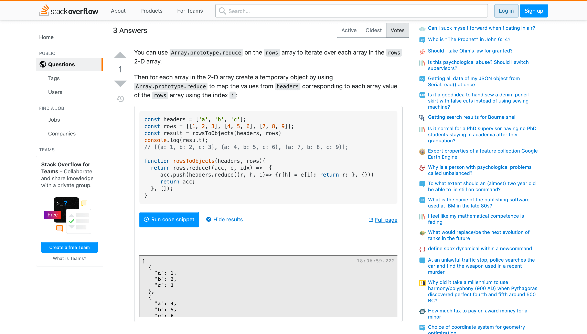

Add a **Run Node.js code** step between `steps.google_sheets` and `steps.respond` and name it `steps.transform`. Then add the code we adapted from the Stack Overflow post (more details below):

```javascript
const data = steps.google_sheets.$return_value.values
const headers = data.shift()
const rows = data
return rowsToObjects(headers, rows) 

function rowsToObjects(headers, rows){
  return rows.reduce((acc, e, idx) =>  {
     acc.push(headers.reduce((r, h, i)=> {r[h] = e[i]; return r; }, {}))
     return acc;
  }, []);
}
```

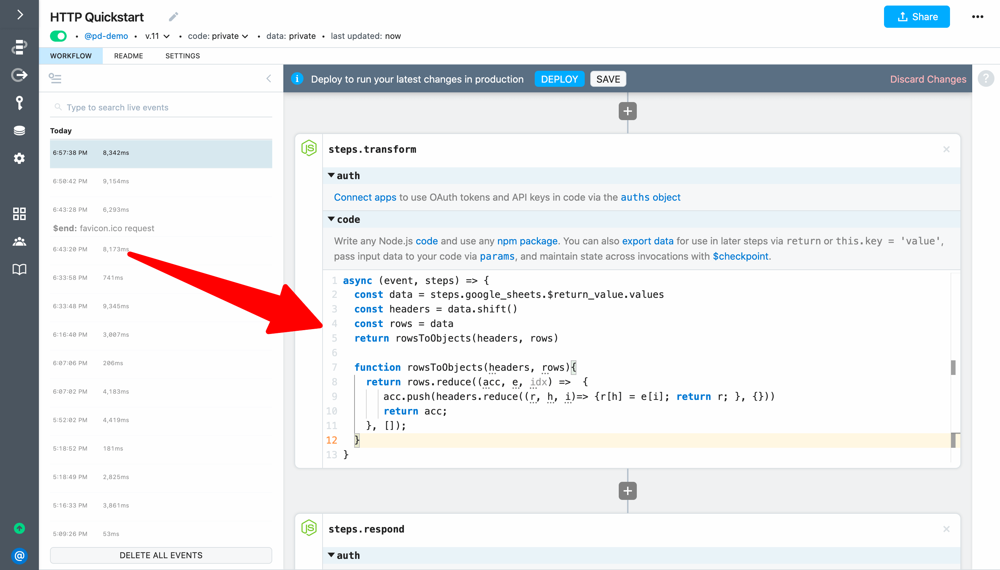

Here are more details about the changes (you can also skip ahead to deploy and test):

1. Set `headers` to the the first array element of `steps.google_sheets.$return_value.values`
2. Set `rows` to the remainder of the array (i.e., the elements with the data)
3. Return the result of `rowsToObjects(headers, rows) ` to export it from the step so we can reference it in our response
4. We can delete the `console.log` statement and the comment

Next, **Deploy** and test your workflow to validate the step returns the data you expect.

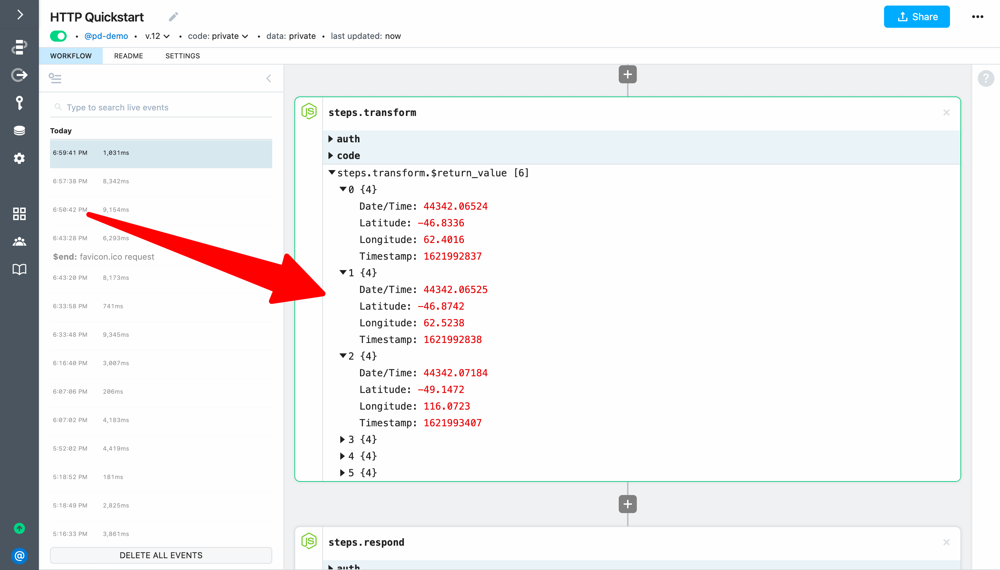

Next, update `steps.respond` to return `steps.transform.$return_value` as the body of the HTTP response.

```javascript
await $respond({
  status: 200,
  immediate: true,
  body: steps.transform.$return_value
})
```

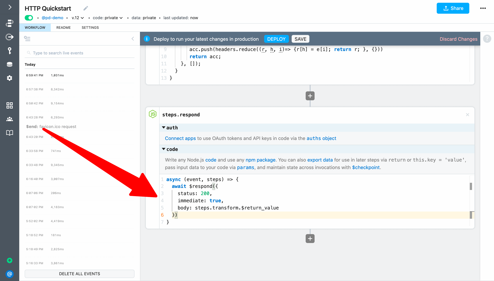

Finally, **Deploy** and load the endpoint URL for your workflow in a browser. You should see the data from Google Sheets with all the positions you recorded for the ISS returned as your workflow response (including the most recent position recorded when you loaded the endpoint):

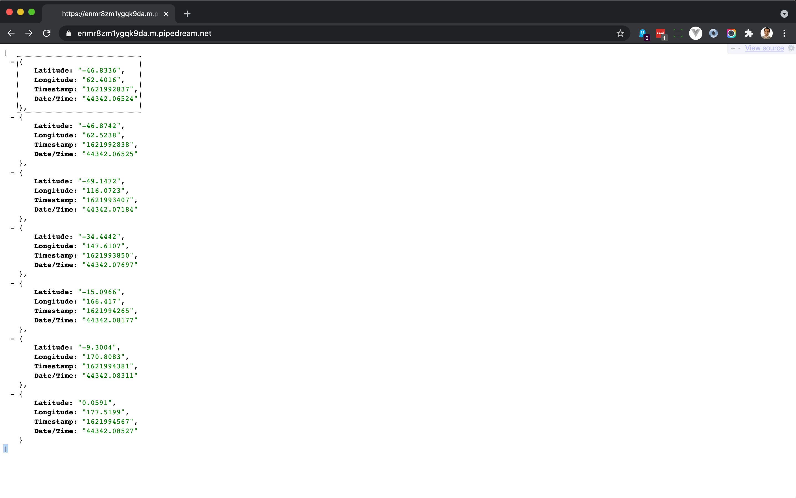

This was all done without exposing any API keys on the client side.

**Next, we'll run a simple workflow on a schedule to keep this serverless workflow "warm".**

<p style="text-align:center;">
<a :href="$withBase('/quickstart/run-workflow-on-a-schedule/')"></a>
</p>