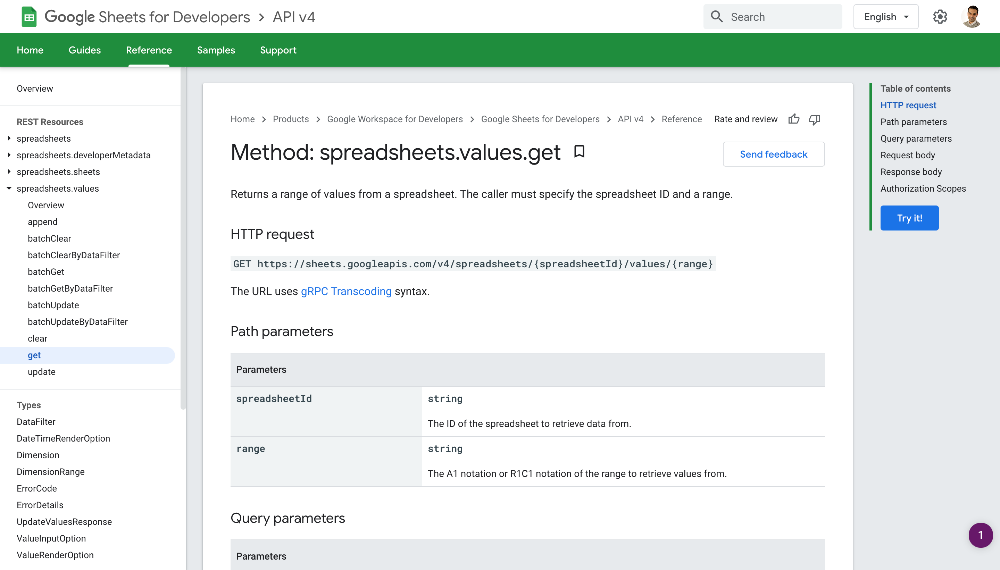

# Use connected accounts in code

In a previous example, we connected our Google Sheets account and used it in a no code action. In this example, let's use the same connected account to authenticate a Google Sheets API request in a code step. This example builds on the workflow created in [previous sections](/quickstart/hello-world/) and will cover how to:

[[toc]]

### Scaffold an API request for an app in Node.js

First, expand the step selector right before `steps.respond`.


Select the **Google Sheet** app and select the **Run Node.js with Google Sheets** action:


This will add a code step scaffolded to use the Google Sheets API. 


### Use a connected account in a code step
Let's test the scaffolded code. First, select the same account you used in the previous step (to save data to Google Sheets). It needs to be the same account because we're going to retrieve data from that sheet in just a moment. 


Then **Deploy** the workflow and **Replay** the last successful event (if you replay a `favicon.ico` request the workflow will end early and this step won't run). Select the event to inspect the exports for this step — you should see the results from Google's `/userinfo` API.


### Use standard API docs to customize scaffolded code

Next, let's customize the API request to retrieve all the ISS positions we added to Google Sheets in our previous tests so we can return them in our workflow response. Based on a quick Google search, we can find the details we need in [Google's developer documentation](https://developers.google.com/sheets/api/reference/rest/v4/spreadsheets.values/get). We need to make a `GET` request to `https://sheets.googleapis.com/v4/spreadsheets/{spreadsheetId}/values/{range}`. 



All we need to do is modify the scaffolded code. First, replace the scaffolded URL of `https://www.googleapis.com/oauth2/v1/userinfo` with `https://sheets.googleapis.com/v4/spreadsheets/{spreadsheetId}/values/{range}`


Next, we need to replace `{spreadsheetId}` and `{range}` with the actual values. Since we added a row to Google Sheets, we can get this from the exports for `steps.add_single_row`. 


1. Add a `$` before both `{spreadsheetId}` and `{range}` to convert the references to template literals (since the URL in enclosed in backticks, we can write code between `${...}`).  
2. Replace `spreadsheetId` with `steps.add_single_row.$return_value.spreadsheetId`. 
3. Since we want to get all the values in the sheet, we can use Javascript's `split()` function to replace `range` with the value to the left of the exclamation mark in `steps.add_single_row.$return_value.updatedRange` (i.e., we only want to pass the value `Sheet1`). To do that, enter `steps.add_single_row.$return_value.updatedRange.split("!")[0]`.

Here's the final code for the step:

```javascript
return await require("@pipedreamhq/platform").axios(this, {
  url: `https://sheets.googleapis.com/v4/spreadsheets/${steps.add_single_row.$return_value.spreadsheetId}/values/${steps.add_single_row.$return_value.updatedRange.split("!")[0]}`,
  headers: {
    Authorization: `Bearer ${auths.google_sheets.oauth_access_token}`,
  },
})
```


When you're ready, **Deploy** and test your workflow again. If you select the event and expand the return value for `steps.google_sheets` you'll see the headers and data from the Google Sheet.


### Use a code snippet from Stack Overflow to transform the API response

While we can update our response to return this data, let's add one more code step to transform it from an array of arrays to an array of objects (using the header values for the keys). Since we can easily transform data using Node.js, we can write the code if we know it or we can search Google for snippets to adapt. In this case, a quick Google Search turns up a [Stack Overflow post](https://stackoverflow.com/questions/58050534/javascript-make-a-key-value-data-structure-from-2-dimensional-arrayheader-row) with sample code we can use as a starting point.


Let's modify the code from that post:

1. Set `headers` to the the first array element of `steps.google_sheets.$return_value.values`
2. Set `rows` to the remainder of the array (i.e., the elements with the data)
3. Return the result of `rowsToObjects(headers, rows) ` to export it from the step so we can reference it in our response
4. We can delete the `console.log` statement and the comment

Here's the updated code:

```javascript
const data = steps.google_sheets.$return_value.values
const headers = data.shift()
const rows = data
return rowsToObjects(headers, rows) 

function rowsToObjects(headers, rows){
  return rows.reduce((acc, e, idx) =>  {
     acc.push(headers.reduce((r, h, i)=> {r[h] = e[i]; return r; }, {}))
     return acc;
  }, []);
}
```

Add a **Run Node.js code** step between `steps.google_sheets` and `steps.respond` and name it `steps.transform`. Then add the code above.


Next, **Deploy** and test your workflow to validate the step returns the data you expect.


Next, update `steps.respond` to return `steps.transform.$return_value` as the body of the HTTP response.

```javascript
await $respond({
  status: 200,
  immediate: true,
  body: steps.transform.$return_value
})
```


Finally, **Deploy** and load the endpoint URL for your workflow in a browser. You should see the data from Google Sheets with all the positions you recorded for the ISS returned as your workflow response (including the most recent position recorded when you loaded the endpoint):


This was all done without exposing any API keys on the client side.

**Next, we'll run a simple workflow on a schedule to keep this serverless workflow "warm". [Take me to the next example &rarr;](../run-workflow-on-a-schedule/)**

