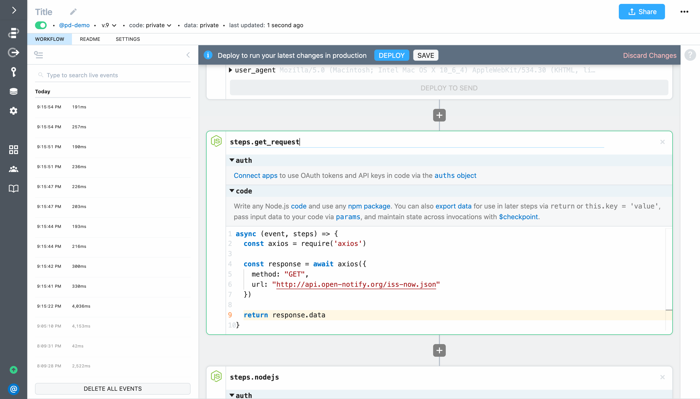
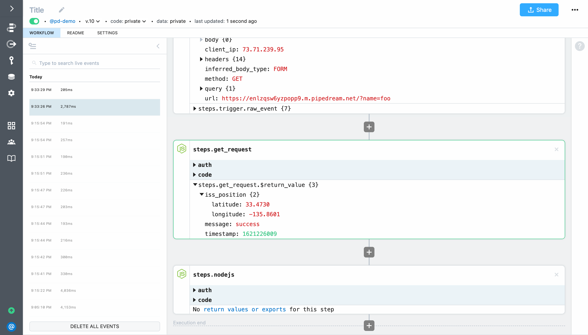

# Use any npm package

Next, let's replace the **GET request** action with a code step that uses the `axios` npm package. The result of the workflow will be the same, but this will introduce you to the pattern for using npm packages in code steps.

First, delete the **GET request** step from your workflow by clicking the **X** buttton at the top right of the step.


Next, click the **+** button and add another Node.js code step (select the **Run Node.js code** option in the right column of the step selector). Your workflow should look like this:


Next, let's `require` the `axios` npm package — there's no `npm install` or `package.json` required. Pipedream will automatically install any npm packages you `require`. The first line of code in the step should look like this:

```javascript
const axios = require('axios')
```

Next, let's make a `GET` request to the open-notify.org API to get the latest position of the ISS (when writing code, remember to `await` all promises):

```javascript
const response = await axios({
  method: "GET",
  url: "http://api.open-notify.org/iss-now.json"
})
```

Finally, let's `return` the data from the API to export it from the step (only exported data can be inspected in the builder and be referenced in later workflow steps). The data we want to export is in the `data` key of the the `axios` response:

```javascript
return response.data
```

Following is the complete code:

```javascript
const axios = require('axios')

const response = await axios({
  method: "GET",
  url: "http://api.open-notify.org/iss-now.json"
})

return response.data
```

Finally, let's rename our step from `steps.nodejs_1` to `steps.get_request` so we don't need to modify the last step of our workflow. Your workflow should now look like this:



Next, click the **Deploy** button, and then load the endpoint URL in your browser again. You should continue to see the ISS position returned. Next, return to your workflow and select the event that corresponds with your most recent test. You should see your `steps.get_request` code step output the same result as the **GET Request** action you just replaced.



When you're done with this quickstart, test out other popular npm packages like `moment`, `loadash`, `luxon` and more!