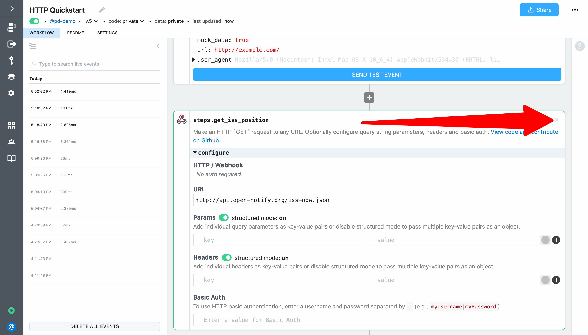
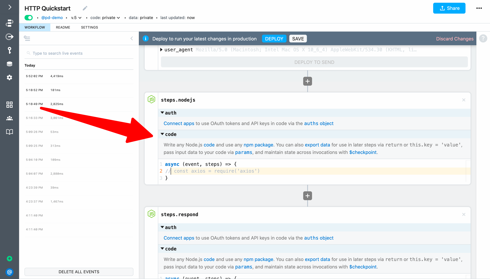
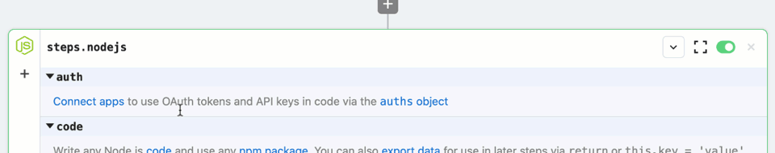
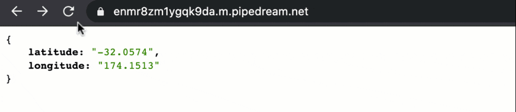
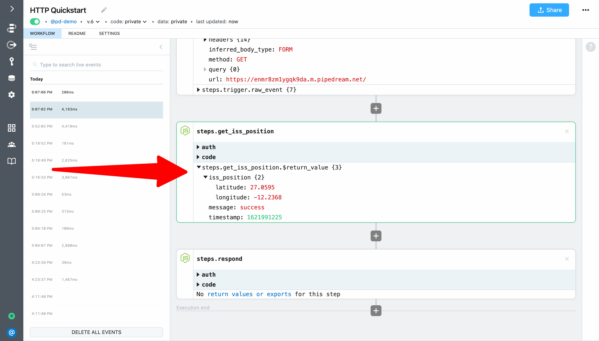

# Use any npm package

Next, let's replace the **GET Request** action with a code step that uses the `axios` npm package. This example builds on the workflow created in [previous sections](/quickstart/) and will cover how to:

[[toc]]

::: tip
If you didn't complete the previous examples, we recommend you start from the [beginning of this guide](/quickstart/). If you still want to start here, [copy this workflow](https://pipedream.com/@gettingstarted/quickstart-make-outbound-http-requests-p_6lCQOLo) and then follow the instructions below. If you have any issues completing this example, you can [view, copy and run a completed version](https://pipedream.com/@gettingstarted/quickstart-use-any-npm-package-p_pWCg5BP).
:::

### Delete a step

First, delete `steps.get_iss_position` by clicking the **X** buttton at the top right of the step.



### Use an npm package in a code step

Let's replace the action with a code step. Next, click the **+** button and add a **Run Node.js code** step to the spot where the action used to be (between the two other steps).



Next, rename the step from `steps.nodejs` to `steps.get_iss_position`. Since we're replicating the behavior of the action we just deleted, the step name needs to be identical so the reference in `steps.respond` continues to work.



Next, add the following code to `steps.get_iss_position` to get the position of ISS using the `axios` npm package (more details below): 

```javascript
const axios = require('axios')

const response = await axios({
  method: "GET",
  url: "http://api.open-notify.org/iss-now.json"
})

return response.data
```

Following is an explanation of what's happening in the code:

1. First, we `require` the `axios` npm pacakge to use it. There's no `npm install` or `package.json` required. Pipedream automatically installs any npm package you `require`.
2. We use `axios` to make a `GET` request to the open-notify.org API to get the latest position of the ISS ([always remember to `await` promises](https://pipedream.com/docs/workflows/steps/code/async/)).
3. Finally, we `return` the API response to export it from the step. Data must be exported to inspect it and reference it in later workflow steps. We return `response.data` since the data we want to export is in the `data` key of the the `axios` response.

Next, **Deploy** your changes and reload the endpoint URL in your browser. You should continue to see the latest ISS position returned. 



Return to your workflow and select the event that corresponds with your most recent test. You should see the `steps.get_iss_position` code step output the ISS position similar to the **GET Request** action you just replaced.



**Next, let's transform data returned by the ISS API and save it to Google Sheets.** 

<p style="text-align:center;">
<a :href="$withBase('/quickstart/add-data-to-google-sheets/')"></a>
</p>