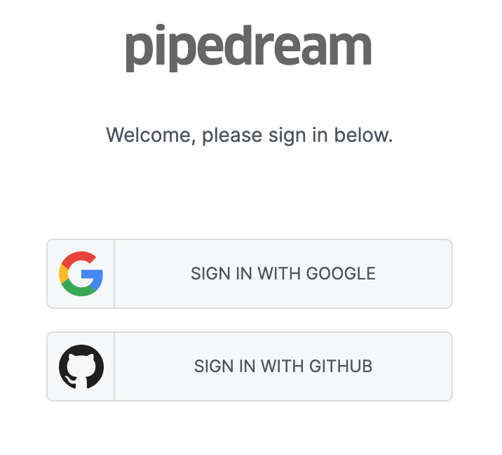

# Signing Up

You can sign up for Pipedream at <a :href="$site.themeConfig.PIPEDREAM_BASE_URL">{{$site.themeConfig.PIPEDREAM_BASE_URL}}</a>.

Click on the **Sign In** link near the top-right of the page.

This should load a modal asking you to sign in with your **Google** or **Github** account:

Using an account from one of these two providers is required for you to sign up for Pipedream. Both are free.

Clicking on either button will direct you to authorize Pipedream to access basic profile information from that provider: your email address, the link to your profile image, etc.

Once you've done that, you'll be asked to choose a username and accept our [Terms of Service](https://pipedream.com/terms/) before continuing:

This username will appear on your public Pipedream profile, along with any public workflows you've created.

Now, get started by [creating your first workflow](/your-first-workflow/).
