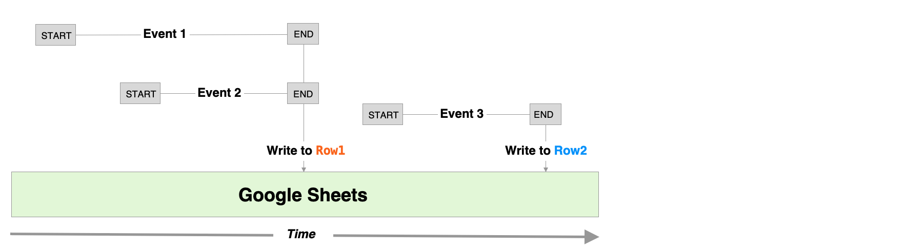
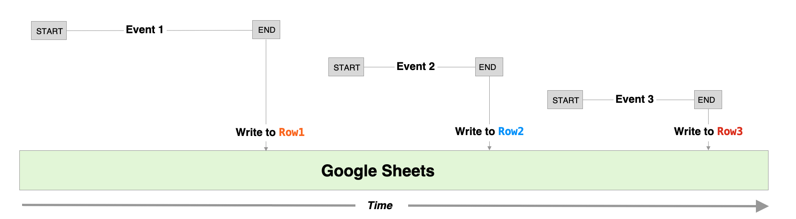
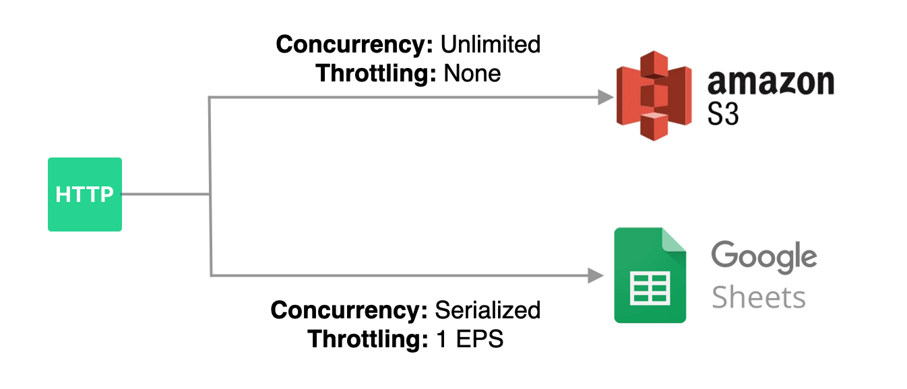
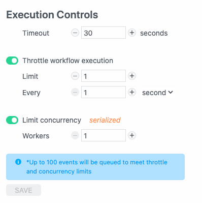
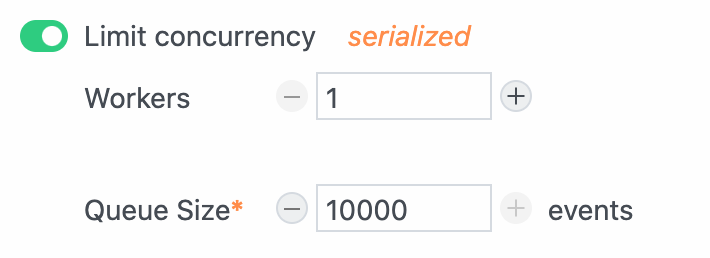

# What are Workflows?

[**Follow our quickstart to build your first workflow**](/quickstart/).

Workflows make it easy to integrate your apps, data, and APIs — all with no servers or infrastructure to manage.

- Workflows are composed of code that is organized and executed as a sequence of linear [**steps**](/docs/workflows/steps).

- Trigger your workflow on any event (e.g., [HTTP requests](/workflows/steps/triggers/#http) or a [schedule](/workflows/steps/triggers/#schedule)).

- Add steps to run Node.js [code](/workflows/steps/code/) (using virtually any [`npm`](/workflows/steps/code/#using-npm-packages) package) and [prebuilt actions](/components/actions/).

- Steps are executed in the order they appear in your workflow.

- Export values for each step and access them via the `steps` object.

<!--
## Steps

Steps are the building blocks you use to create workflows. You can easily combine multiple steps into a workflow to integrate your apps, data and APIs: 

- Steps include triggers, code and prebuilt actions.

- Steps are executed linearly, in the order they appear in your workflow.

- You can pass data between steps using `steps` objects.

- You can observe the execution results for each step including export values, logs and errors.

### Trigger

Every workflow begins with a single [**trigger**](/workflows/steps/triggers/) step. Trigger steps initiate the execution of a workflow; i.e., workflows execute on each trigger event. For example, you can create an [HTTP trigger](/workflows/steps/triggers/#http) to accept HTTP requests. We give you a unique URL where you can send HTTP requests, and your workflow is executed on each request.

### Code, Actions

[**Actions**](/components/actions/) and [**code**](/workflows/steps/code/) steps drive the logic of your workflow. Anytime your workflow runs, Pipedream will execute each step of your workflow in order. Actions are prebuilt code steps that let you connect to hundreds of APIs without writing code. When you need more control than the default actions provide, code steps let you write any custom Node.js code.

Code and action steps cannot precede triggers, since they'll have no data to operate on.

Once you save a workflow, we deploy it to our servers. Each event triggers the workflow code, whether you have the workflow open in your browser, or not.

<!-- 
## Concurrency and Throttling

Pipedream makes it easy to manage the concurrency and rate at which events trigger your workflow code using execution controls.

### Overview

Workflows listen for events and execute as soon as they are triggered. While this behavior is expected for many use cases, there can be unintended consequences.

#### Concurrency

Without restricting concurrency, events can be processed in parallel and there is no guarantee that they will execute in the order in which they were received. This can cause race conditions.

For example, if two workflow events try to add data to Google Sheets simultaneously, they may both attempt to write data to the same row. As a result, one event can overwrite data from another event. The diagram below illustrates this example — both `Event 1` and `Event 2` attempt to write data to Google Sheets concurrently — as a result, they will both write to the same row and the data for one event will be overwritten and lost (and no error will be thrown).



You can avoid race conditions like this by limiting workflow concurrency to a single "worker". What this means is that only one event will be processed at a time, and the next event will not start processing until the first is complete (unprocesssed events will maintained in a queue and processed by the workflow in order). The following diagram illustrates how the events in the last diagram would executed if concurrency was limited to a single worker.



While the first example resulted in only two rows of data in Google Sheets, this time data for all three events are recorded to three separate rows.

#### Throttling

If your workflow integrates with any APIs, then you may need to limit the rate at which your workflow executes to avoid hitting rate limits from your API provider. Since event-driven workflows are stateless, you can't manage the rate of execution from within your workflow code. Pipedream's execution controls solve this problem by allowing you to control the maximum number of times a workflow may be invoked over a specific period of time (e.g., up to 1 event every second).

### Usage

Events emitted from a source to a workflow are placed in a queue, and Pipedream triggers your workflow with events from the queue based on your concurrency and throttling settings. These settings may be customized per workflow (so the same events may be processed at different rates by different workflows).



The maximum number of events Pipedream will queue per workflow depends on your account type.

- Up to 100 events will be queued per workflow for the [Developer Tier](/pricing/#developer-tier)
- Workflows owned by paid plans may have custom limits. If you need a larger queue size, [see here](#increasing-the-queue-size-for-a-workflow).

**IMPORTANT:** If the number of events emitted to a workflow exceeds the queue size, events will be lost. If that happens, an error message will be displayed in the event list of your workflow and your [global error workflow](/workflows/error-handling/global-error-workflow/) will be triggered.

To learn more about how the feature works and technical details, check out our [engineering blog post](https://blog.pipedream.com/concurrency-controls-design/).

#### Where Do I Manage Concurrency and Throttling?

Concurrency and throttling can be managed in the **Execution Controls** section of your **Workflow Settings**. Event queues are currently supported for any workflow that is triggered by an event source. Event queues are not currently supported for native workflow triggers (native HTTP, cron, SDK and email).



#### Managing Event Concurrency

Concurrency controls define how many events can be executed in parallel. To enforce serialized, in-order execution, limit concurrency to `1` worker. This guarantees that each event will only be processed once the execution for the previous event is complete.

To execute events in parallel, increase the number of workers (the number of workers defines the maximum number of concurrent events that may be processed), or disable concurrency controls for unlimited parallelization.

#### Throttling Workflow Execution

To throttle workflow execution, enable it in your workflow settings and configure the **limit** and **interval**.

The limit defines how many events (from `0-10000`) to process in a given time period.

The interval defines the time period over which the limit will be enforced. You may specify the time period as a number of seconds, minutes or hours (ranging from `1-10000`)

#### Applying Concurrency and Throttling Together

The conditions for both concurrency and throttling must be met in order for a new event to trigger a workflow execution. Here are some examples:

| Concurrency | Throttling           | Result                                                                                                                                                                                                                                                                                                                                                                                                                                                |
| ----------- | -------------------- | ----------------------------------------------------------------------------------------------------------------------------------------------------------------------------------------------------------------------------------------------------------------------------------------------------------------------------------------------------------------------------------------------------------------------------------------------------- |
| Off         | Off                  | Events will trigger your workflow **as soon as they are received**. Events may execute in parallel.                                                                                                                                                                                                                                                                                                                                                   |
| 1 Worker    | Off                  | Events will trigger your workflow in a **serialized pattern** (a maximum of 1 event will be processed at a time). As soon as one event finishes processing, the next event in the queue will be processed.                                                                                                                                                                                                                                            |
| 1 Worker    | 1 Event per Second   | Events will trigger your workflow in a **serialized pattern** at a **maximum rate** of 1 event per second. <br /><br />If an event takes <u>less</u> than one second to finish processing, the next event in the queue will not being processing until 1 second from the start of the most recently processed event. <br />If an event takes <u>longer</u> than one second to process, the next event in the queue will begin processing immediately. |
| 1 Worker    | 10 Events per Minute | Events will trigger your workflow in a **serialized pattern** at a **maximum rate** of 10 events per minute. <br /><br />If an event takes <u>less</u> than one minute to finish processing, the next event in the queue immediately begin processing. If 10 events been processed in less than one minute, the remaining events will be queued until 1 minute from the start of the initial event.<br />                                             |
| 5 Workers   | Off                  | Up to 5 events will trigger your workflow in parallel as soon as they are received. If more events arrive while 5 events are being processed, they will be queued and executed in order as soon as an event completes processing.                                                                                                                                                                                                                     |

#### Pausing Workflow Execution

To stop the queue from invoking your workflow, throttle workflow execution and set the limit to `0`.

#### Increasing the queue size for a workflow

By default, your workflow can hold up to {{$site.themeConfig.DEFAULT_WORKFLOW_QUEUE_SIZE}} events in its queue at once. Any events that arrive once the queue is full will be dropped, and you'll see an [Event Queue Full](/errors/#event-queue-full) error.

For example, if you serialize the execution of your workflow by setting a concurrency of `1`, but receive 200 events from your workflow's event source at once, the workflow's queue can only hold the first 100 events. The last 100 events will be dropped.

Users on [paid tiers](https://pipedream.com/pricing) can [increase their queue size up to {{$site.themeConfig.MAX_WORKFLOW_QUEUE_SIZE}}](/workflows/events/concurrency-and-throttling/#increasing-the-queue-size-for-a-workflow) for a given workflow, just below the **Concurrency** section of your **Execution Controls** settings:

<div>

</div>

## Network / IP range

By default, any network request (e.g. an HTTP request or a connection to a database) you make from Pipedream will originate from the `us-east-1` region of AWS. [AWS publishes the IP address range](https://docs.aws.amazon.com/general/latest/gr/aws-ip-ranges.html) for all regions, but Pipedream shares this range with other services using AWS.

If you use a service that requires you whitelist a range of IP addresses, you have two options.

### HTTP requests

If you need to send HTTP requests to a service from a fixed range of IP addresses, [see these docs](/workflows/steps/code/nodejs/http-requests/#ip-addresses-for-http-requests-made-from-pipedream-workflows).

### Non-HTTP traffic (databases, etc.)

If you need to connect to a service from a fixed range of IP addresses, you can setup a [bastion server](https://medium.com/codex/how-to-setup-bastion-server-with-aws-ec2-b1590d2ff815). A bastion server only runs an SSH service (like [OpenSSH](https://www.openssh.com/)) that listens for incoming SSH connections. You can connect to the bastion host from any IP address, but when you configure the firewall for your service (like your database), you open it up only to the IP address of your bastion server.

Then, in your Pipedream workflow, you can [tunnel the connection](https://linuxize.com/post/how-to-setup-ssh-tunneling/#:~:text=SSH%20tunneling%20or%20SSH%20port,services%20ports%20can%20be%20relayed.&text=%2D%20Forwards%20a%20connection%20from%20the,Remote%20Port%20Forwarding.) to your service through the bastion host.

Here are two example workflows that show you how to connect to services through a bastion server:

- [Run a MySQL query through an SSH tunnel](https://pipedream.com/@dylburger/run-a-query-on-mysql-via-ssh-tunnel-p_rvCxrNB/edit)
- [Run a PostgreSQL query through an SSH tunnel](https://pipedream.com/@dylburger/run-a-query-on-postgres-via-ssh-tunnel-p_13CvRz/edit)

### Feature request for Pipedream restricting its IP range

Pipedream plans to restrict the range of IP addresses for workflows in the future. Please [upvote this GitHub issue](https://github.com/PipedreamHQ/pipedream/issues/178) to follow the status of that work.


<!--
## Step Names

Steps have names, which appear at the top of the step:

<div>

</div>

When you [share data between steps](#step-exports), you'll use this name to reference that shared data. For example, `steps.trigger.event` contains the event that triggered your workflow. If you exported a property called `myData` from this code step, you'd reference that in other steps using `steps.nodejs.myData`. See the docs on [step exports](#step-exports) to learn more.

You can rename a step by clicking on its name and typing a new one in its place:

<div>

</div>

After changing a step name, you'll need to update any references to the old step. In this example, you'd now reference this step as `steps.my_awesome_code_step`.

<!--
### Passing data to steps

#### Passing data to code steps (step parameters)

[Code steps are just functions](/workflows/steps/code/#async-function-declaration). As functions, they can accept parameters.

To define a parameter, simply reference it in your code. For example, try adding this code to your step:

```javascript
console.log(params.name);
```

then save or deploy your workflow. You'll see a form appear above your code step, prompting you to pass data to the `name` param. You can edit its name, description, type, and more from this UI.

Parameters promote reusability. They make it easier for others to use your workflow, since it's clear what values they need to pass to the step to get it working.

[Read more about params here](/workflows/steps/params/).

#### Passing data to components

When you're developing [components](/components/), you can accept input [using props](/components/api/#props).

When you use a [component action](/components/actions/) in a workflow, you can pass data to its props using [the params form](/workflows/steps/params/#entering-expressions).

### Step Exports

By default, variables declared in a step are scoped to that step.

```js
// The variable myData can only be used within this step
const myData = 1;
```

To share data between steps, you can use **step exports**.

Your trigger step automatically exports the event that triggered your workflow in the variable `steps.trigger.event`. You can reference this variable in any step.

```js
// In any step, you can reference the contents of the trigger event
console.log(steps.trigger.event);
```

When you export your own data from steps, you'll access it at the variable `steps.[STEP NAME].[EXPORT NAME]`. For example, a code step might export data at `steps.nodejs.myData`. You can reference this variable in any code step or [step parameter](#passing-data-to-steps-step-parameters).

#### Exporting data in code steps

You can export data from code steps in one of two ways: using named exports or `return`. The examples below are also included in [this workflow](https://pipedream.com/@dylburger/step-exports-example-p_xMC86w/edit), so you can copy and run it to see how this works.

##### Use named exports

The variable `this` is a reference to the current step. `this` is a JavaScript object, and it's mutable. You can export any [JSON-serializable](https://stackoverflow.com/a/3316779/10795955) data from a step by setting properties of `this`:

```js
this.exportedData = "I can use this data in another step";
this.anotherProperty = {
  data: "I can export any JSON-serializable data",
  foo: "bar",
};
```

When your workflow runs, you'll see the named exports appear below your step, with the data you exported. You can reference these exports in other steps using `steps.[STEP NAME].[EXPORT NAME]`.

Let's assume the step above was named `myStep`. You'd reference its exports in any subsequent step like so:

```js
console.log(steps.myStep.exportedData);
console.log(steps.myStep.anotherProperty);
```

##### Use `return`

You can also export data from steps using `return`:

```js
return {
  data: "I can use this data in another step",
};
```

When you use `return`, the exported data will appear at `steps.[STEP NAME].$return_value`. For example, if you ran the code above in a step named `nodejs`, you'd reference the returned data using `steps.nodejs.$return_value.data`.

Like with named exports, the returned data will appear below the step.

#### Exporting data from component actions

The syntax for exporting data in [component actions](/components/actions/) is slightly different than in code steps.

##### Using `return`

Use `return` to return data from an action:

```javascript
async run({ $ }) {
  return "data"
}
```

When you use return, the exported data will appear at `steps.[STEP NAME].$return_value`. For example, if you ran the code above in a step named `nodejs`, you'd reference the returned data using `steps.nodejs.$return_value`.

##### Using `$.export`

You can also use `$.export` to return named exports from an action. `$export` takes the name of the export as the first argument, and the value to export as the second argument:

```javascript
async run({ $ }) {
  $.export("name", "value")
}
```

When your workflow runs, you'll see the named exports appear below your step, with the data you exported. You can reference these exports in other steps using `steps.[STEP NAME].[EXPORT NAME]`.
-->

