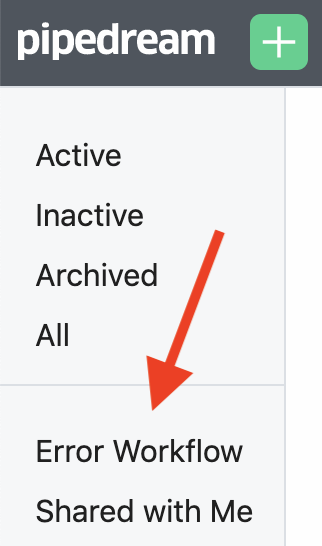
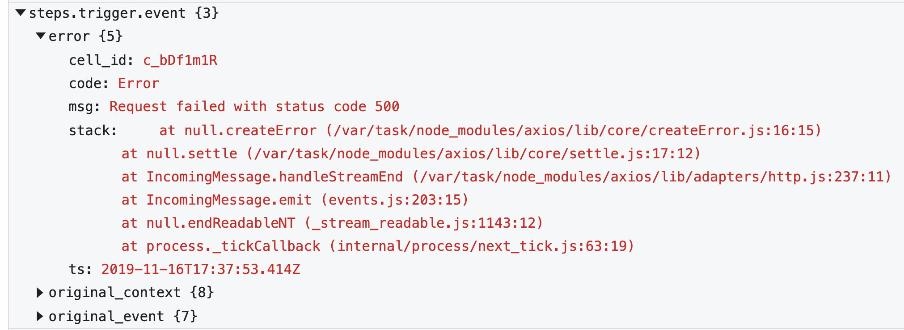

# Global Error Workflow

The global error workflow allows you to run code in response to errors from any workflow. We believe code gives you full control over how you handle errors, and where you send them.

When you sign up for Pipedream, this workflow is automatically created for you. You can access it from your workflow dashboard, by clicking on the **Error Workflow** label: 

By default, any time an unhandled error is raised in a workflow, it gets sent to the global error workflow.

The default error workflow emails you anytime there's an error in a workflow, once a day per error type, per workflow. This ensures you don't get flooded with emails on high-volume workflows.

This email contains information about the error, with a link to the workflow and event where the error happened.

## Modifying the global error workflow

The global error workflow is yours, unique to your account. Since it's just another workflow, you can modify it however you'd like.

Here are a few improvements we've seen people make:

- Send formatted error messages to Slack, instead of email.
- Send errors to Pagerduty.
- Log errors in a table in the [SQL service](/destinations/sql/) so you can run SQL on them, or in Google Sheets for easier analysis.

## Error format

Events sent to the global error workflow have the following properties:

- `error` : contains information about the error, for example the `code` (its type), the `msg`, and the `stack`, which contains its stack trace.
- `original_event` : contains the original event (see the [event format](/workflows/events/#event-format) docs for an explanation of the event properties).
- `original_context` : contains the original workflow context object.

For example, an error event might look something like this:

## Modifying how errors are raised from workflow

By default, errors raised in any workflow are sent to the global error workflow.

If you'd prefer not to send errors from a particular workflow, visit the workflow and click on the **Settings** label on the left. Then toggle the **Errors** setting _off_:

## What happens if an error is raised in the error workflow itself?

**Unhandled errors raised in the global error workflow are not sent to the global error workflow**, since that could cause an infinite loop that would lock up the workflow.

Errors in the error workflow will still be displayed in the Inspector next to the workflow, so you can troubleshoot issues.

If you modify the workflow, take care to test those changes thoroughly so that you ensure you're still handling errors. [Replaying previous events](/workflows/events/replay/) through the workflow can help you test it on real data.
