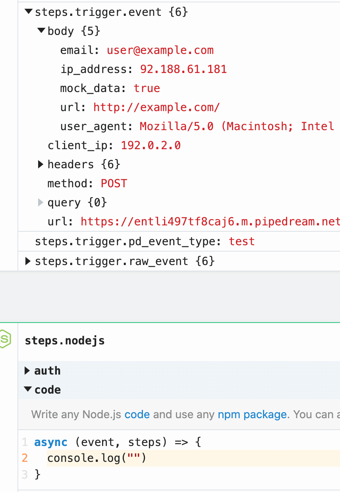

# What are events?

Events trigger workflow executions. The event that triggers your workflow depends on the trigger you select for your workflow: 

- [HTTP triggers](/workflows/steps/triggers/#http) invoke your workflow on HTTP requests.
- [Cron triggers](/workflows/steps/triggers/#schedule) invoke your workflow on a time schedule (e.g., on an interval).
- [Email triggers](/workflows/steps/triggers/#email) invoke your workflow on inbound emails.
- [App-based triggers](/workflows/steps/triggers/#app-based-triggers) invoke your workflow on events from apps like Twitter, Google Calendar, and more.

---

[[toc]]

## Examining incoming event data

When you send an event to your workflow, you'll see it appear to the left of your workflow's code, in [the inspector](/workflows/events/inspect/#the-inspector)

Click on an event to see the incoming event data (the HTTP request, email, or other data, depending on your trigger type) in the trigger step at the top of your workflow:

Pipedream parses your incoming data and exposes it in the variable [`steps.trigger.event`](#event-format), which you can access in any [workflow step](/workflows/steps/).

If you add steps to your workflow, you'll see that step's execution data (logs or [step exports](/workflows/steps/#step-exports)) just below the step:

Click on the event in the inspector again to de-select the event, returning to your workflow's code.

## Copying references to event data

When you're [examining event data](#examining-incoming-event-data), you'll commonly want to copy the name of the variable that points to the data you need to reference in another step.

Hover over the property whose data you want to reference, and click the **Copy Path** button to its right:

## Copying the values of event data

You can also copy the value of specific properties of your event data. Hover over the property whose data you want to copy, and click the **Copy Value** button to its right:

## Event format

When you send an event to your workflow, Pipedream takes the trigger data — for example, the HTTP payload, headers, etc. — and adds our own Pipedream metadata to it.

**This data is exposed as a variable you can reference in the rest of your workflow, using either of these two names**:

- `steps.trigger.event`
- `event` (shorthand reference)

When you click on an event in [the inspector](/workflows/events/inspect/#the-inspector), we show you the contents of `steps.trigger.event` at the top of your workflow, in the trigger step.

You can reference your event data in any [code](/workflows/steps/code/) or [action](/workflows/steps/actions/) step. See those docs or the general [docs on passing data between steps](/workflows/steps/) for more information.

The specific shape of `event` varies with the trigger type:

### HTTP

| Property             |                      Description                      |
| -------------------- | :---------------------------------------------------: |
| `body`               | A string or object representation of the HTTP payload |
| `client_ip`          |    IP address of the client that made the request     |
| `headers`            |        HTTP headers, represented as an object         |
| `inferred_body_type` |                  For example, `JSON`                  |
| `method`             |                      HTTP method                      |
| `url`                |                  Request host + path                  |

### Cron Scheduler

| Property       |                Description                |
| -------------- | :---------------------------------------: |
| `timer_config` |   String representation of the schedule   |
| `timestamp`    | The epoch timestamp when the workflow ran |

### Email

We use Amazon SES to receive emails for the email trigger. You can find the shape of the event in the [SES docs](https://docs.aws.amazon.com/ses/latest/DeveloperGuide/receiving-email-notifications-contents.html).

## `steps.trigger.raw_event`

In addition to the formatted object we expose in `steps.trigger.event`, you have access to the raw, protocol-specific data from the event, as well.

You can access this data in `steps.trigger.raw_event`. The contents also vary with the trigger type:

- HTTP : The base64-encoded representation of the raw payload, along with the full incoming URI.
- Cron Scheduler : same as `event`.
- Email : same as `event`.

## `steps.trigger.context`

`steps.trigger.event` and `steps.trigger.raw_event` both contain your event's **data**. `steps.trigger.context` contains _metadata_ about the workflow and the invocation tied to this event.

You can use the data in `steps.trigger.context` to uniquely identify the Pipedream event ID, the timestamp at which the event invoked the workflow, and more:

| Property           |                                    Description                                     |
| ------------------ | :--------------------------------------------------------------------------------: |
| `deployment_id`    |     A globally-unique string representing the current version of the workflow      |
| `id`               | A unique, Pipedream-provided identifier for the event that triggered this workflow |
| `owner_id`         |            The Pipedream-assigned user ID for the owner of the workflow            |
| `platform_version` |        The version of the Pipedream execution environment this event ran on        |
| `ts`               |           The ISO 8601 timestamp at which the event invoked the workflow           |
| `workflow_id`      |                                  The workflow ID                                   |

You may notice other properties in `context`. These are used internally by Pipedream, and are subject to change.

<Footer />
