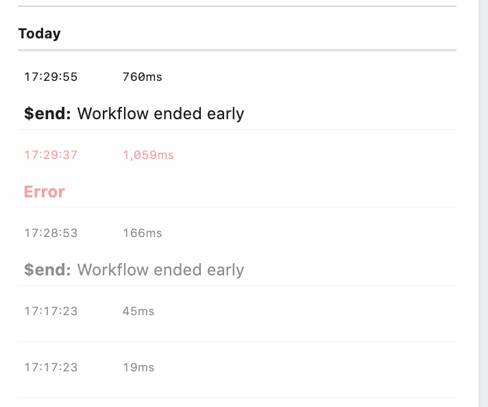

# Inspect Events

[The inspector](#the-inspector) lists the events you send to a [workflow](/workflows/). Once you choose a [trigger](/workflows/steps/triggers/) and send events to it, you'll see those events in the inspector, to the left of your workflow. 

Clicking on an event from the list lets you [review the incoming event data and workflow execution logs](/workflows/events/#examining-incoming-event-data) for that event.

You can use the inspector to replay events, delete them, and more.

[[toc]]

## The inspector

The inspector lists your workflow's events:

## Live / Pause

Events appear in the inspector in real-time; you shouldn't have to refresh the page to see them. This is the default mode.

If your events arrive at a fast rate, it can be helpful to pause the display of those events. Hover over the section labeled **Today** and press the **Pause** button to pause the event stream. Press **Paused** again to see the live stream again.

**Events sent to a source still invoke your workflow, but they do not show up in the Inspector** while you're in a paused state.

## Search

Above the inspector, you'll see a search box you can use to filter the list of events:

Here are a few things to note about searches:

- Search is case-insensitive. Both "post" and "POST" should match queries sent using the HTTP `POST` method, for example.
- We perform partial string matches on the text you're searching for. "test" will match events with "test" and "testing" in the body.
- We search through all field names and values in the event. For example, you can search for text in the HTTP method, path, body and more.

## Event Duration

The duration shown next to each event notes the time it took to run your code, in addition to the time it took Pipedream to handle the execution of that code and manage its output. Specifically,

**Duration = Time Your Code Ran + Pipedream Execution Time**

## Replaying and deleting events

Hover over an event, and you'll see two buttons:

The blue button with the arrow **replays** the event against the newest version of your workflow. The red button with the X **deletes** the event.

You can also delete all events currently in the inspector by pressing the **Delete All Events** button at the bottom of the inspector.

## Messages

Any `console.log()` statements or other output of code steps is attached to the associated code cells. But [`$end()`](/workflows/steps/code/#end) or [exceptions](/workflows/steps/code/#exceptions) end a workflow's execution, so their details appear in the inspector:

## Events from older versions your workflow

When you modify and save your workflow, we increment its version:

Events sent to the newest version of your workflow appear in black in the Inspector. Events from older versions appear in grey:

When you select events from older versions of your workflow, note that we display the workflow and all associated observability at that point in time. So if an older version of your workflow had a code step, or an action, that you've subsequently removed, it will still appear with older events sent to that version. [Read more here](/workflows/managing/#reverting-your-workflow-to-a-previous-version).

## Limits

Pipedream retains a limited history of events for a given workflow. See the [limits docs](/limits/#event-execution-history) for more information.

<Footer />
