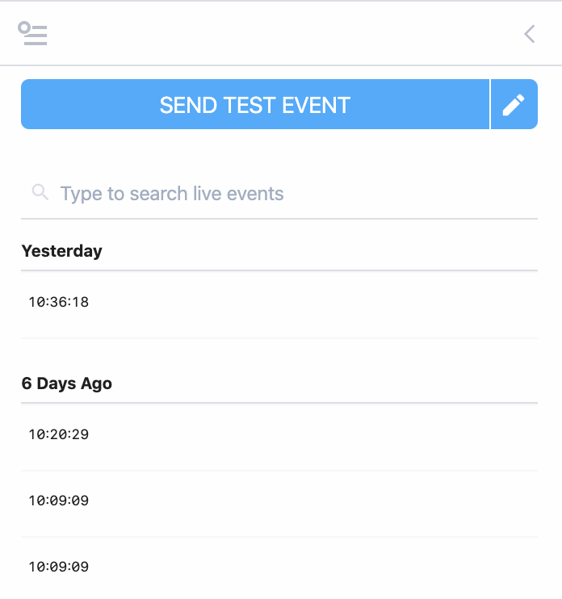

# Inspect Events

[The Inspector](#the-inspector) lists the events you send to a [trigger](/workflows/steps/triggers/). Once you choose a trigger and send events to it, you'll see those events in the Inspector, to the left of your workflow.

Clicking on an event from the list shows the event data in the Inspector, as well as the logs and observability associated with the execution for that event.

Let's review each of the Inspector's components and fields below.

[[toc]]

## The Inspector

The Inspector is the section of your workflow that lists your events, allows you to [send or modify test events](/workflows/events/test/#send-test-events), and more:

## Live / Pause

The **Live** and **Pause** labels near the top of [the Inspector](#the-inspector) are clickable. Toggling your inspector to **Live** lists events as they are sent to your source. Events should appear in real-time; you shouldn't have to refresh the page to see them. This is the default mode.

Clicking **Pause** pauses the stream of events in the UI. **Events sent to a source still invoke your workflow, but they do not show up in the Inspector** while you're in a paused state.

While paused, we show the number of events received by your source:

Clicking **Live** should immediately list the events that arrived while the Inspector was paused.

## Search

To the right of the **Live / Pause** toggle, we've provided a search box you can use to filter the list of events:

Here are a few things to note about searches:

- Search is case-insensitive. Both "post" and "POST" should match queries sent using the HTTP `POST` method, for example.
- We perform partial string matches on the text you're searching for. "test" will match events with "test" and "testing" in the body.
- We search through all field names and values in the event. For example, you can search for text in the HTTP method, path, body and more.

## Columns in the event list

We display the most useful properties of source data as columns in [the Inspector](#the-inspector):

### Date / Time

You can see the date and time each event was received, in your system's **local time**.

Pipedream group events in the Inspector by day, and refers to the dates by relative time, for example:

## Duration

The **Duration** field shows the time it took to run your code, in addition to the time it took Pipedream to handle the execution of that code and manage its output.

Specifically,

**Duration = Time Your Code Ran + Pipedream Execution Time**

Destination delivery is handled asynchonously, after your code is run. The **Duration** here is tied to the runtime of your code. Separately, you can see the [destination runtime](/destinations/#asynchronous-delivery) in the destination cells themselves.

## Messages

Any `console.log()` statements or other output of code steps is attached to the associated code cells. But [`$end()`](/workflows/steps/code/#end) or [exceptions](/workflows/steps/code/#exceptions) end a workflow's execution, so their details are worth displaying prominently:

## Events from older versions your workflow

When you modify and save your workflow, we increment its version:

Events sent to the newest version of your workflow appear in black in the Inspector. Events from older versions appear in grey:

When you select events from older versions of your workflow, note that we display the workflow and all associated observability at that point in time. So if an older version of your workflow had a code step, or an action, that you've subsequently removed, it will still appear with older events sent to that version.

## Limits

Pipedream retains a limited history of events for a given workflow. See the [limits docs](/limits/#event-execution-history) for more information.

<Footer />
