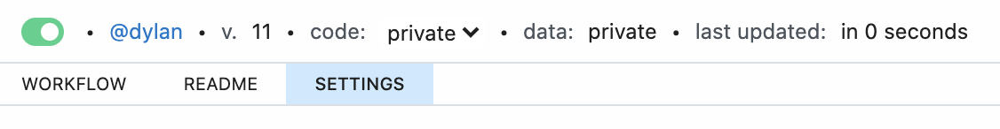
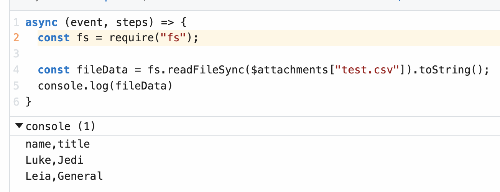
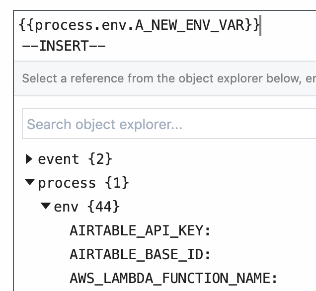

# Managing

[[toc]]

## Workflow Settings

You can control workflow-specific settings in the **Settings** header, just above your workflow's code.

<div>

</div>

### Errors

By default, any errors raised in a workflow are sent to the **Global Error Workflow**. This workflow sends you an email with the details of this error, once per error, per workflow, per 24-hour period. 

But the Global Error Workflow is just another workflow, and lives in your account. So you can modify it however you'd like. For example, you can send errors to Slack, or send critical issues to Pagerduty, or log all errors to a table in the [SQL service](/destinations/sql/) for later analysis.

### Execution Controls

#### Execution Timeout Limit

Workflows have a default [execution limit](/limits/#time-per-execution), which defines the time workflows can run for a single invocation until they're timed out.

If your workflow times out, and needs to run for longer than the [default limit](/limits/#time-per-execution), you can change that limit here.

#### Memory

By default, workflows run with `{{$site.themeConfig.MEMORY_LIMIT}}` of memory. If you're processing a lot of data in memory, you might need to raise that limit. Here, you can increase the memory of your workflow up to `{{$site.themeConfig.MEMORY_ABSOLUTE_LIMIT}}`.

**Pipedream charges invocations proportional to your memory configuration**. When you modify your memory settings, Pipedream will show you the number of invocations you'll be charged per execution. [Read more here](/pricing/#how-does-workflow-memory-affect-billable-invocations).

#### Concurrency and Throttling

[Manage the concurrency and rate](/workflows/events/concurrency-and-throttling/) at which events from a source trigger your workflow code.

### Current checkpoint values

If you're using [`$checkpoint`](/workflows/steps/code/#workflow-level-state-checkpoint) or [`this.$checkpoint`](/workflows/steps/code/#step-level-state-this-checkpoint) to manage state in your workflow, you can view their values here. You can also modify the values or clear the whole contents of a given checkpoint.

### Attachments

Sometimes, you'll need to reference static files in your workflow, like a CSV. Files uploaded in the **Attachments** section can be referenced in your workflow using the `$attachments` object.

For example, if you upload a file named `test.csv`, Pipedream will expose the _file path_ of the uploaded file at `$attachments["test.csv"]`. You can read the contents of the file using `fs.readFileSync`:

```javascript
import fs from "fs";

const fileData = fs.readFileSync($attachments["test.csv"]).toString();
console.log(fileData);
```

<div>

</div>

#### Limits

Each attachment is limited to `10MB` in size. The total size of all attachments within a single workflow cannot exceed `200MB`.

## Copying Workflows

When you find a public workflow that you want to use, you **Copy** it into your own account. You own the copy, and can run and modify that copy however you'd like.

When you find the workflow that you'd like to copy, click the big green **Copy** button near the top-right corner of the workflow.

If you're not signed into your Pipedream account, or haven't yet signed up, you'll be prompted to. 

## Environment Variables

**Environment variables** enable you to separate secrets and other data from your code.

You should not include API keys or other sensitive data directly in your workflow's code. This is especially important if you [make your workflow public](/public-workflows/), since anyone would be able to see your API key in plain sight. By referencing the value of an environment variable, instead, your workflow includes a reference to that variable — `process.env.API_KEY` — instead of the API key itself.

Environment variables are defined at the account-level, and can be referenced in [workflow code](/workflows/steps/code/) or [step params](/workflows/steps/params/).

### Creating, updating environment variables

Environment variables are managed at the account-level. You can access your environment variables at <a href="https://pipedream.com/settings/env-vars">{{$site.themeConfig.PIPEDREAM_BASE_URL}}/settings/env-vars</a>.

To add an environment variable, click the **New Environment Variable** button.

To edit an environment variable, click the **Reveal / Edit** button next to a specific variable.

Updates to environment variables will be made available to your workflows as soon as the save operation is complete — typically a few seconds after you click **Save**. If you update the value of an environment variable in the UI, your workflow should automatically use that new value where it's referenced.

### Referencing environment variables in code

You can reference the value of any environment variable using the object [`process.env`](https://nodejs.org/dist/latest-v10.x/docs/api/process.html#process_process_env). This object contains environment variables as key-value pairs.

For example, let's say you have an environment variable named `API_KEY`. You can reference its value using `process.env.API_KEY`:

```javascript
const url = `http://yourapi.com/endpoint/?api_key=${process.env.API_KEY}`;
```

Variable names are case-sensitive. Use the name you defined in your Environment settings in the app when referencing your variable in `process.env`.

Referencing an environment variable that doesn't exist returns the value `undefined` in Node.js. For example, if you try to reference `process.env.API_KEY` without first defining the `API_KEY` variable in your environment settings, it will return the value `undefined`.

::: warning
Logging the value of any environment variables — for example, using `console.log` — will include that value in the logs associated with the cell. Please keep this in mind and take care not to print the values of sensitive secrets.
:::

### Referencing environment variables in actions

[Actions](/components/actions/) are prebuilt code steps that provide a form for passing [params](/workflows/steps/params/) as input.

You can reference the value of environment variables using <code v-pre>{{process.env.YOUR_ENV_VAR}}</code>. You'll see a list of your environment variables in the [object explorer](/workflows/steps/params/#use-the-object-explorer):

<div>

</div>

### Copying workflows that use environment variables

Your environment variables are made available to any running workflow. **If you copy a public workflow that uses an environment variable, make sure you review the code to see what environment variables it's using**.

Reviewing the code ensures you have the necessary variables defined for the workflow to run correctly, and makes sure the original workflow author isn't reading variables that you don't need for the workflow to function. You can always modify the code for the workflow after copying to remove these variables, or change their names.

### Limits

Currently, **environment variables are only exposed in Pipedream workflows, [not event sources](https://github.com/PipedreamHQ/pipedream/issues/583)**.

The value of any environment variable may be no longer than `64KB`.

The names of environment variables must start with a letter or underscore. Pipedream also reserves environment variables that start with `PIPEDREAM_` for internal use. You cannot create an environment variable that begins with that prefix.

<Footer />
