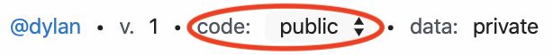
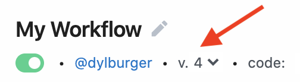
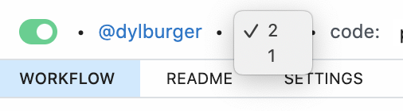

# Edit and Manage

[[toc]]

## Editing Title and Description

When you create a workflow, you can edit the **Title** and **Description** near the top. We also present some helpful information — the workflow's author, the current version, and visibility state of the code and data, and when the workflow was last updated:

## Workflow visibility

On the [Developer (free) tier](/pricing/#developer-tier), **all workflow code is public by default. The data you send to a workflow, or logs you generate, are private**. On the [Professional tier](/pricing/#professional-tier), all workflow code is **private** by default.

You can change the visibility of workflow code using the dropdown menu to the right of the **code** label at the top of your workflow:

Please see our [docs on public workflows](/public-workflows/) for more information about workflow visibility and privacy.

## Copying public workflows

We hope that the workflows you write are helpful for others. If you've written a workflow to send all Stripe transaction data to a Redshift data warehouse, for example, someone else will probably want to use your workflow to solve that same use case.

If you've used [Github](https://github.com/), you can think of each workflow as a unique, public repository. It's code that anyone can view and copy for their own use.

On Pipedream, anyone can find a public workflow, [copy it](/workflows/copy/), and run it, modifying any of the steps within the workflow to make it work for their use case.

## Saving and Running your Workflow

When you edit the code in the workflow and save those changes, we deploy a new version:

All events sent to the trigger will run against the most recent version of the workflow.

Code and action steps of Pipedream workflows are executed in the order they appear. These steps can be interleaved — we impose no order besides the "trigger must come first" rule noted above.

## Reverting your workflow to a previous version

Each time you deploy your workflow, Pipedream generates a new, immutable version that represents the state of the workflow at that point in time. Versions are numeric, and increment (i.e. a workflow starts at version **1**, then increments to version **2** with the next deploy). You can find the current version just above your workflow code:

If you need to revert your workflow to a previous version, click on that menu and select it from the list:

This will display the code for that version of your workflow below. To revert your workflow to this version, click **Redploy This Version** on the far right of the header that appears:

**Since versions of a workflow are immutable, this will deploy a _new_ version of your workflow with the same code of the version you chose to re-deploy.**

When you select a specific event from [the inspector](/workflows/events/inspect/#the-inspector), you'll also see this header appear, noting the version of the workflow that event ran against and the option to re-deploy that version.

## Sharing Workflows

To share your workflow with others, click the **Share** button in the top-right of your workflow:

There are two types of ways to share your workflow:

- You can share your workflow code with others so they can copy it and use it with their own connected accounts. [Workflow code is public by default](/public-workflows/), and you can find your workflow's shareable URL here.
- You can also add collaborators to your workflow. Collaborators can edit the code and see its events and execution details. Add collaborators by Pipedream username or email address. Pipedream sends an email to that user asking them to accept the collaboration request. Once they do, they'll be able to edit the workflow and view its events and execution details.

## Deactivating Workflows

Workflows can be deactivated by switching the toggle in the top-left corner of any workflow. By defaut, this toggle is green, which means your workflow is active:

Clicking the toggle deactivates your workflow:

**Deactivating a workflow has a different impact for different [triggers](/workflows/steps/triggers/)**. For instance, deactivating a workflow with an [HTTP trigger](/workflows/steps/triggers/#http) disables the associated endpoint from receiving HTTP requests (those endpoints will respond with a 404 HTTP status code). Disabling a workflow with a Cron Scheduler trigger will disable the cron job.

By default, inactive workflows are displayed on the list of workflows on the homepage. Active workflows appear with a green vertical bar to their left, inactive workflows with a grey bar. You can remove inactive workflows from the homepage by toggling the **Show inactive** checkbox at the top of that page.

## Archiving Workflows

Since running workflows is [free](/pricing/), we encourage you to create as many as you want to test new ideas and understand how the product works. After you create a workflow, you may no longer need it. **We support archiving workflows to remove them from your list of workflows on your homepage**.

You can archive any workflow by clicking on the ellipsis in the top-right corner of your workflow and selecting **Archive this workflow**:

Archived workflows do not appear in the list of workflows on your homepage by default.

## Keyboard Shortcuts

We provide a few keyboard shortcuts to simplify workflow development:

| Operation |     Shortcut(s)     |
| --------- | :-----------------: |
| Save      | ⌘ + S or `Ctrl` + S |
| Deploy    | ⌘ + D or `Ctrl` + D |

## More resources

Read more about each of the components of a Pipedream workflow below:

- [Sources](/workflows/steps/triggers/)
- [The Inspector](/workflows/events/inspect/)
- [Code](/workflows/steps/code/)
- [Destinations](/destinations/)
- [SQL](/destinations/sql/)

<Footer />
