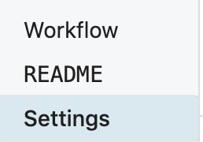

# Workflow Settings

You can control workflow-specific settings in the **Settings** header, just above your workflow's code.

<div>

</div>

[[toc]]

## Errors

By default, any errors raised in a workflow are sent to the **Global Error Workflow**. This workflow sends you an email with the details of this error, once per error, per workflow, per 24-hour period. 

But the Global Error Workflow is just another workflow, and lives in your account. So you can modify it however you'd like. For example, you can send errors to Slack, or send critical issues to Pagerduty, or log all errors to a table in the [SQL service](/destinations/sql/) for later analysis.

## Execution Controls

### Execution Timeout Limit

Workflows have a default [execution limit](/limits/#time-per-execution), which defines the time workflows can run for a single invocation until they're timed out.

If your workflow times out, and needs to run for longer than the [default limit](/limits/#time-per-execution), you can change that limit here.

### Memory

By default, workflows run with `{{$site.themeConfig.MEMORY_LIMIT}}` of memory. If you're processing a lot of data in memory, you might need to raise that limit. Here, you can increase the memory of your workflow up to `{{$site.themeConfig.MEMORY_ABSOLUTE_LIMIT}}`.

**Pipedream charges invocations proportional to your memory configuration**. When you modify your memory settings, Pipedream will show you the number of invocations you'll be charged per execution. [Read more here](/pricing/#how-does-workflow-memory-affect-billable-invocations).

### Concurrency and Throttling

[Manage the concurrency and rate](/workflows/events/concurrency-and-throttling/) at which events from a source trigger your workflow code.

## Current checkpoint values

If you're using [`$checkpoint`](/workflows/steps/code/#workflow-level-state-checkpoint) or [`this.$checkpoint`](/workflows/steps/code/#step-level-state-this-checkpoint) to manage state in your workflow, you can view their values here. You can also modify the values or clear the whole contents of a given checkpoint.

## Attachments

Sometimes, you'll need to reference static files in your workflow, like a CSV. Files uploaded in the **Attachments** section can be referenced in your workflow using the `$attachments` object.

For example, if you upload a file named `test.csv`, Pipedream will expose the _file path_ of the uploaded file at `$attachments["test.csv]`. You can read the contents of the file using `fs.readFileSync`:

```javascript
const fs = require("fs");

const fileData = fs.readFileSync($attachments["test.csv"]).toString();
console.log(fileData);
```

<div>

</div>

### Limits

Each attachment is limited to `10MB` in size. The total size of all attachments within a single workflow cannot exceed `200MB`.
