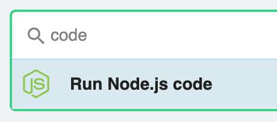

# Code

Often, you'll want to modify events in a highly custom way. You may need to look up additional metadata about the event, parse raw data into more meaningful fields, or end the execution of a workflow early under some conditions. Code steps let you do this and more. 

Code steps currently let you execute [Node.js v{{$site.themeConfig.NODE_VERSION}}](https://nodejs.org/dist/latest-v10.x/docs/api/errors.html#errors_errors) (JavaScript) code, using JavaScript's extensive [npm](https://www.npmjs.com/) package ecosystem within your code. Virtually anything you can do in Node.js, you can do in a code step.

Code steps are optional, but common. If the data received by your source needs no modification, and can be sent directly to a destination, you don't need code steps in a workflow.

[[toc]]

## Language Support

Pipedream supports [Node.js v{{$site.themeConfig.NODE_VERSION}}](https://nodejs.org/dist/latest-v10.x/docs/api/).

It's important to understand the core difference between Node.js and the JavaScript that runs in your web browser: **Node doesn't have access to some of the things a browser expects, like the HTML on the page, or the URL of the page**. If you haven't used Node before, be aware of this limitation as you search for JavaScript examples on the web.

**Anything you can do with Node.js, you can do in a workflow**. This includes using most of [npm's 400,000 packages](#using-npm-packages).

If you'd like to see another, specific language supported, please [let us know](https://pipedream.com/community).

JavaScript is one of the [most used](https://insights.stackoverflow.com/survey/2019#technology-_-programming-scripting-and-markup-languages) [languages](https://github.blog/2018-11-15-state-of-the-octoverse-top-programming-languages/) in the world, with a thriving community and [extensive package ecosystem](https://www.npmjs.com). If you work on websites and know JavaScript well, Pipedream makes you a full stack engineer. If you've never used JavaScript, see the [resources below](#new-to-javascript).

## Adding a code step

[Add a new Action](/workflows/steps/actions/#adding-a-new-action), search for "**code**", and select the **Run Node.js Code** action:

<div>

</div>

You can add any Node.js code in the text editor that appears. For example, try:

```javascript
console.log("This is Node.js code");
console.log(
  `Here are all the keys I sent in my event body: ${Object.keys(event.body)}`
);
this.test = "Some test data";
return "Test data";
```

Code steps support syntax highlighting and automatic indentation.

## Passing parameters to code steps

You can make code steps reusable by allowing them to accept parameters. Instead of hard-coding the values of variables within the code itself, you can pass them to the code step as arguments or parameters, instead.

[Read more about using step parameters here](/workflows/steps/#passing-data-to-steps-step-parameters).

## `async` function declaration

You'll notice an [`async` function](https://developer.mozilla.org/en-US/docs/Web/JavaScript/Reference/Statements/async_function) declaration that appears when you add a new code step:

```javascript
async (event, steps) => {
  // this node.js code will execute when your workflow is triggered
};
```

This communicates a couple of key concepts:

- Any async code within a code step [**must** be run synchronously](/workflows/steps/code/async/), using the `await` keyword or with a Promise chain, using `.then()`, `.catch()`, and related methods.
- Pipedream passes the variables `event` and `steps` to every code step. `event` is a read-only object that contains the data that triggered your event, for example the HTTP request sent to your workflow's endpoint. `steps` is also an object, and contains the [data exported from previous steps](/workflows/steps/#step-exports) in your workflow.

If you're using [step parameters](/workflows/steps/#passing-data-to-steps-step-parameters) or [connect an account to a step](/connected-accounts/#from-a-code-step), you may notice two new parameters passed to the function signature, `params` and `auths`:

```javascript
async (event, steps, params, auths) => {
  // this node.js code will execute when your workflow is triggered
};
```

When you use [step parameters](/workflows/steps/#passing-data-to-steps-step-parameters), Pipedream passes the `params` object (named pairs of param key and its associated value) to the function.

When you [connect an account to a step](/connected-accounts/#from-a-code-step), Pipedream passes the [`auths` object](/workflows/steps/code/auth/#the-auths-object) to the function.

## Logs

You can call `console.log()` or `console.error()` to add logs to the execution of a code step. These logs will appear just below the associated step. `console.log()` messages appear in black, `console.error()` in red.

## Syntax errors

We try to catch any syntax errors when you're writing code, highlighting the lines where the error occurred in red.

::: warning
While you can save a workflow with syntax errors, it's unlikely to run correctly on new events. Make sure to fix syntax errors before running your workflow.
:::

## Using `npm` packages

[npm](https://www.npmjs.com/) hosts JavaScript packages: bits of code someone else has written and packaged for others to use. npm has over 400,000 packages and counting. You can use most of those on Pipedream.

To use an npm package in a code step, simply `require()` it:

```javascript
const _ = require("lodash");
```

When we run your workflow code, we download the associated npm package for you before running your code steps.

If you've used Node before, you'll notice there's no `package.json` file to upload or edit. We want to make package management simple, so just `require()` the module like you would in your code, after package installation, and get to work.

The core limitation of packages is one we described above: some packages require access to a web browser to run, and don't work with Node. Often this limitation is documented on the package `README`, but often it's not. If you're not sure and need to use it, we recommend just trying to `require()` it.

Moreover, packages that require access to large binaries — for example, how [Puppeteer](https://pptr.dev) requires Chromium — may not work on Pipedream. If you're seeing any issues with a specific package, please [let us know](/support/).

## Variable scope

Any variables you create within a step are scoped to that step. That is, they cannot be referenced in any other step.

Within a step, the [normal rules of JavaScript variable scope](https://developer.mozilla.org/en-US/docs/Glossary/Scope) apply.

**When you need to share data across steps, use [step exports](/workflows/steps/).**

## Making HTTP requests from your workflow

There are two ways to make HTTP requests on Pipedream:

- Use any HTTP client that works with Node.js. [See this example guide for how to use `axios` to make HTTP requests](/workflows/steps/code/nodejs/http-requests/).
- [Use `$send.http()`](/destinations/http/#using-send-http), a Pipedream-provided method for making asynchronous HTTP requests.

In general, if you just need to make an HTTP request but don't care about the response, [use `$send.http()`](/destinations/http/#using-send-http). If you need to operate on the data in the HTTP response in the rest of your workflow, [use `axios`](/workflows/steps/code/nodejs/http-requests/).

## Returning HTTP responses

You can return HTTP responses from [HTTP-triggered workflows](/workflows/steps/triggers/#http) using the [`$respond()` function](/workflows/steps/triggers/#customizing-the-http-response).

## Managing state

See the docs on [workflow state](/workflows/steps/code/state/).

## `$end`

Sometimes you want to end your workflow early, or otherwise stop or cancel the execution or a workflow under certain conditions. For example:

- You may want to end your workflow early if you don't receive all the fields you expect in the event data.
- You only want to run your workflow for 5% of all events sent to your source.
- You only want to run your workflow for users in the United States. If you receive a request from outside the U.S., you don't want the rest of the code in your workflow to run.
- You may use the `user_id` contained in the event to look up information in an external API. If you can't find data in the API tied to that user, you don't want to proceed.

**In any code step, calling the `$end()` function will end the execution of the workflow immediately.** No remaining code in that step, and no code or destination steps below, will run for the current event.

```javascript
$end();
console.log("This code will not run, since $end() was called above it");
```

You can pass any string as an argument to `$end()`:

```javascript
$end("Event doesn't have the correct schema");
```

This message will appear in the Inspector in the **Messages** column for the event where `$end()` was called:

<div>

</div>

Like any other code, `$end()` can be called conditionally:

```javascript
// Flip a coin, running $end() for 50% of events
if (Math.random() > 0.5) {
  $end();
}
console.log("This code will only run 50% of the time");
```

## Errors

[Errors](https://nodejs.org/dist/latest-v10.x/docs/api/errors.html#errors_errors) raised in a code step will stop the execution of code or destinations that follow.

You'll see the message associated with the error in the Inspector and the code step where the error was raised.

<div>

</div>

## Using secrets in code

Workflow code is private by default, but [you can make a workflow public](/public-workflows/). In either case, we recommend you don't include secrets — API keys, tokens, or other sensitive values — directly in code steps.

Pipedream supports [environment variables](/environment-variables/) for keeping secrets separate from code. Once you create an environment variable in Pipedream, you can reference it in any workflow using `process.env.VARIABLE_NAME`. The values of environment variables are private.

See the [Environment Variables](/environment-variables/) docs for more information.

## Limitations of code steps

Code steps operate within the [general constraints on workflows](/limits/#workflows). As long as you stay within those limits and abide by our [acceptable use policy](/limits/#acceptable-use), you can add any number of code steps in a workflow to do virtually anything you'd be able to do in Node.js.

If you're trying to run code that doesn't work or you have questions about any limits on code steps, [please reach out](/support/).

## Editor settings

We use the [Monaco Editor](https://microsoft.github.io/monaco-editor/), which powers VS Code and other web-based editors.

We also let you customize the editor. For example, you can enable Vim mode, and change the default tab size for indented code. Visit your [**Settings**](https://pipedream.com/settings) to modify these settings.

## Keyboard Shortcuts

We use the [Monaco Editor](https://microsoft.github.io/monaco-editor/), which powers VS Code. As a result, many of the VS Code [keyboard shortcuts](https://code.visualstudio.com/docs/getstarted/keybindings) should work in the context of the editor.

For example, you can use shortcuts to search for text, format code, and more.

## New to JavaScript?

We understand many of you might be new to JavaScript, and provide resources for you to learn the language below.

When you're searching for how to do something in JavaScript, some of the code you try might not work in Pipedream. This could be because the code expects to run in a browser, not a Node.js environment. The same goes for [npm packages](#using-npm-packages).

### I'm new to programming

Many of the most basic JavaScript tutorials are geared towards writing code for a web browser to run. This is great for learning — a webpage is one of the coolest things you can build with code. We recommend starting with these general JavaScript tutorials and trying the code you learn on Pipedream:

- [JavaScript For Cats](http://jsforcats.com/)
- [Mozilla - Java​Script First Steps](https://developer.mozilla.org/en-US/docs/Learn/JavaScript/First_steps)
- [StackOverflow](https://stackoverflow.com/) operates a programming Q&A site that typically has the first Google result when you're searching for something specific. It's a great place to find answers to common questions.

### I know how to code, but don't know JavaScript

- [A re-introduction to Java​Script (JS tutorial)](https://developer.mozilla.org/en-US/docs/Web/JavaScript/A_re-introduction_to_JavaScript)
- [MDN language overview](https://developer.mozilla.org/en-US/docs/Web/JavaScript)
- [Eloquent Javascript](https://eloquentjavascript.net/)
- [Node School](https://nodeschool.io/)
- [You Don't Know JS](https://github.com/getify/You-Dont-Know-JS)

<Footer />
