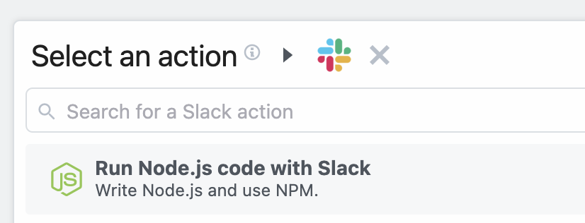

# Auth in code steps

::: warning This doc doesn't apply to components
This document applies only to [Node.js workflow code steps](/workflows/steps/code/). If you're developing a component, like a source or action, see [the component API docs](/components/api/#app-props).
:::

When you use [prebuilt actions](/components/actions/) tied to apps, you don't need to write the code to authorize API requests. Just [connect your account](/connected-accounts/#connecting-accounts) for that app and run your workflow.

But sometimes you'll need to [write your own code](/workflows/steps/code/). You can also connect apps to custom code steps, using the auth information to authorize requests to that app.

For example, you may want to send a Slack message from a step. We use Slack's OAuth integration to authorize requests to Slack, so you can connect your account to this step and send a message using the access token Pipedream generates for you at `auths.slack.oauth_access_token`:

```javascript
const { WebClient } = require('@slack/web-api')
const web = new WebClient(auths.slack.oauth_access_token)
return await web.chat.postMessage({
  text: "Hello, world!",
  channel: "#general",
})
```

[[toc]]

## The `auths` object

In our Slack example above, we create a Slack `WebClient` using the Slack OAuth access token:

```javascript
const web = new WebClient(auths.slack.oauth_access_token);
```

This access token is generated by Pipedream, and passed to this step in the `auths` object:

```javascript
async (event, steps, auths) => {
  ...
}
```

`auths` contains named properties for each account you connect to the associated step. Here, we connected Slack, so `auths.slack` contains the Slack auth info (the `oauth_access_token`).

You can view the named properties of the `auths` object for connected accounts next to the account connections:

<div>

</div>

The names of the properties for each connected account will differ with the account. Pipedream typically exposes OAuth access tokens as `oauth_access_token`, and API keys under the property `api_key`. But if there's a service-specific name for the tokens (for example, if the service calls it `server_token`), we prefer that name, instead.

To list the `auths` properties available to you for a given app, run `Object.keys` on the app:

```javascript
console.log(Object.keys(auths.slack)) // Replace auths.slack with your app's name
```

and run your workflow. You'll see the property names in the logs below your step.

## Writing custom steps to use `auths`

You can write code that utilizes connected accounts in a couple of different ways:

### Using the code templates tied to apps

When you write custom code that connects to an app, you can start with a code snippet Pipedream provides for each app. This is called the **test request**.

When you search for an app in a step:

1. Click the **+** button below any step.
2. Search for the app you're looking for and select it from the list.
3. Select the option to **Run Node.js code with [app]**.

<div>

</div>

This code operates as a template you can extend, and comes preconfigured with the connection to the target app and the code for authorizing requests to the API. You can modify this code however you'd like.

### Manually connecting apps to steps

See the Connected Accounts docs for [connecting an account to a code step](/connected-accounts/#from-a-code-step).

## Custom auth tokens / secrets

When you want to connect to a 3rd party service that isn't supported by Pipedream, you can store those secrets in [Environment Variables](/environment-variables/).

<Footer />
