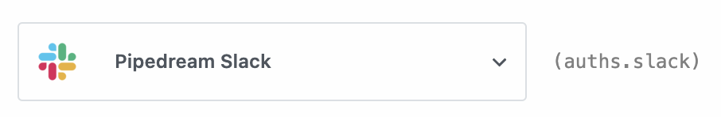

# Auth in code steps

When you use [prebuilt actions](/workflows/steps/actions/) tied to apps, you don't need to write the code to authorize API requests. Just [connect your account](/connected-accounts/#connecting-accounts) for that app and run your workflow.

Often, though, you'll need to write your own code. You can also connect apps to custom code steps, utilizing the auth information to authorize requests to that app. 

For example, you may want to send a Slack message from a step. We use Slack's OAuth integration to authorize requests to Slack, so you can connect your account to this step and send a message using the access token Pipedream generates for you at `auths.slack.oauth_access_token`:

<div>

</div>

[[toc]]

## The `auths` object

In our Slack example above, we create a Slack `WebClient` using the Slack OAuth access token:

```javascript
const web = new WebClient(auths.slack.oauth_access_token);
```

This access token is generated by Pipedream, and passed to this step in the `auths` object:

```javascript
async (event, steps, auths) => {
  ...
}
```

`auths` contains named properties for each account you connect to the associated step. Here, we connected Slack, so `auths.slack` contains the Slack auth info (the `oauth_access_token`).

You can view the named properties of the `auths` object for connected accounts next to the account connections:

<div>

</div>

The names of the properties for each connected account will differ with the account. Pipedream typically exposes OAuth access tokens as `oauth_access_token`, and API keys under the property `api_key`. But if there's a service-specific name for the tokens (for example, if the service calls it `server_token`), we prefer that name, instead.

## Writing custom steps to use `auths`

There are a couple of ways to write code that utilizes connected accounts:

### Using the code templates tied to apps

When we integrate new apps, we'll create a code snippet that functions as the **test request** for that app. When you search for an app in a step:

<div>

</div>

and select it, you'll be presented with its actions. You'll see the **Run Node.js code with [APP]** step at the top of the list:

<div>

</div>

In Slack's case, the test request retrieves basic profile information:

<div>

</div>

This code operates as a template you can extend, and comes preconfigured with the connection to the target app and the code for authorizing requests to the API. You can extend this code however you'd like.

### Manually connecting apps to steps

See the Connected Accounts docs for [connecting an account to a code step](/connected-accounts/#from-a-code-step).

## Custom auth tokens

For situations where you have a secret that you're using to connect to a 3rd party service that isn't supported by Pipedream, you can store those secrets in [Environment Variables](/environment-variables/).

<Footer />
