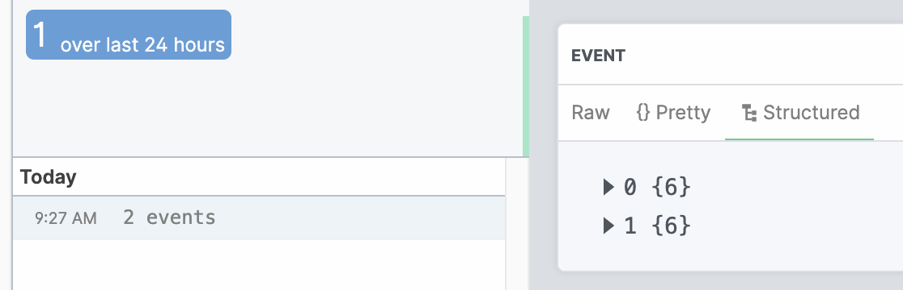

<p align="center">
  <a href="https://pipedream.com/community"></a>
  <a href="https://twitter.com/intent/follow?original_referer=https%3A%2F%2Fpublish.twitter.com%2F%3FbuttonType%3DFollowButton%26query%3Dhttps%253A%252F%252Ftwitter.com%252Fpipedream%26widget%3DButton&ref_src=twsrc%5Etfw&region=follow_link&screen_name=pipedream&tw_p=followbutton"></a>
</p>

## HTTP Event Sources

Pipedream is a platform for running hosted, backend components. HTTP event sources are essentially request bins that can be managed via API.

**Pipedream components are reusable Node.js modules that run code on specific events**: HTTP requests and timers. Components are [free to run](#pricing) and [simple to learn](/COMPONENT-API.md). Here's a component that spins up a hosted HTTP server on deploy and logs inbound HTTP requests:

```javascript
module.exports = {
  name: "http",
  version: "0.0.1",
  props: {
    http: "$.interface.http",
  },
  run(event) {
    console.log(event); // event contains the method, payload, etc.
  },
};
```

Components come with a [built-in key-value store](/COMPONENT-API.md#db), an interface for passing input via [props](/COMPONENT-API.md#props), and more. You deploy and manage components using Pipedream's [REST API](https://docs.pipedream.com/api/rest/), [CLI](https://docs.pipedream.com/cli/reference/), or [UI](https://pipedream.com/sources).

[Components can emit events](/COMPONENT-API.md#emit), which can be retrieved programmatically via [CLI](https://docs.pipedream.com/cli/reference/), [API](https://docs.pipedream.com/api/rest/) or [SSE](https://docs.pipedream.com/api/sse/). They can also trigger [Pipedream workflows](https://docs.pipedream.com/workflows/) on every event. For example, you can process items from an RSS feed and access the items via REST API, or trigger code to run on every new item using the SSE interface or a workflow.

**Components that emit events are called event sources**. This `README` covers [HTTP event sources](#what-are-http-event-sources), the simplest type of source. They're essentially free, hosted HTTP applications that you can program with Node.js. Since all of the components referenced in this `README` are also event sources, we use the terms interchangeably below.

Run through the [quickstart](#quickstart) to create your first source.

## Quickstart

[Install the Pipedream CLI](https://docs.pipedream.com/cli/reference/#installing-the-cli), then run:

```bash
pd deploy http-new-requests
```

This deploys an [HTTP event source](#what-are-http-event-sources) and creates a unique endpoint URL you can send any HTTP requests to:

```text
  id: dc_abc123
  name: http
  endpoint: https://myendpoint.m.pipedream.net
```

The CLI will automatically listen for new requests to this URL, displaying them in your shell as soon as they arrive. **Send a test request using the provided cURL command to give it a try**.

You can retrieve requests to this endpoint programmatically, using Pipedream's [REST API](https://docs.pipedream.com/api/rest/#get-source-events), [CLI](https://docs.pipedream.com/cli/reference/#command-reference) or a [private SSE stream](https://docs.pipedream.com/api/sse/) tied to your event source.

You can also run any Node.js code on HTTP requests to filter or transform them, issue a custom HTTP response, and more — [see the example components below](#example-http-sources).

## Reference

<!--ts-->

- [HTTP Event Sources](#http-event-sources)
- [Quickstart](#quickstart)
- [Reference](#reference)
- [Why use components?](#why-use-components)
- [What are HTTP event sources?](#what-are-http-event-sources)
- [Docs](#docs)
- [Example HTTP sources](#example-http-sources)
  - [Emit only the HTTP payload instead of the whole event](#emit-only-the-http-payload-instead-of-the-whole-event)
  - [Return a custom HTTP status code](#return-a-custom-http-status-code)
  - [Issue a completely custom HTTP response (status, body, headers)](#issue-a-completely-custom-http-response-status-body-headers)
  - [Authorize inbound requests with a secret](#authorize-inbound-requests-with-a-secret)
  - [Batch incoming requests, emitting them as a batch](#batch-incoming-requests-emitting-them-as-a-batch)
- [Consuming event data from your own app, outside Pipedream](#consuming-event-data-from-your-own-app-outside-pipedream)
  - [How to emit events](#how-to-emit-events)
  - [Retrieving events programmatically](#retrieving-events-programmatically)
- [Logs](#logs)
- [Using npm packages](#using-npm-packages)
- [Pricing](#pricing)
- [Limits](#limits)
- [Getting Support](#getting-support)

<!-- Added by: dylansather, at: Fri May 29 09:32:03 PDT 2020 -->

<!--te-->

## Why use components?

Components are similar to serverless functions, like those offered by AWS Lambda. You don't have to manage the server that runs the code — components are hosted on Pipedream infrastructure — and they run on specific events like HTTP requests and timers.

But we believe components are simpler to learn, write, and maintain for many use cases. They let you focus more on the code, and less on the configuration of the function and its associated services:

- You can configure an HTTP server [via props](/COMPONENT-API.md#http), and can use a [built-in key-value store](/COMPONENT-API.md#db) to manage state. Components creates the HTTP interface for you on deploy, and the key-value store comes for free: there's no need to create these resources manually.
- Components are built to be reusable. They can accept input via [props](/COMPONENT-API.md#props), which a user sets on deploy.
- Components are self-contained. Their name, version, props, and code are all defined in one file. This makes components easy to understand at a glance, and easy to fork and modify.

This is also an early release. [The component API](/COMPONENT-API.md) will improve over time. **Right now, we're looking for any and all [feedback](https://pipedream.com/community)**. Tell us what you're building, what works and what doesn't, and anything you think would improve the product.

## What are HTTP event sources?

HTTP sources are the simplest type of event source. When you create an HTTP source,

- Pipedream generates a unique HTTP endpoint that you can send any HTTP request to.
- You can view the details of any HTTP request sent to your endpoint: its payload, headers, and more.
- You can delete the source and its associated events once you're done.

HTTP sources are essentially [request bins](https://requestbin.com) that can be managed via API.

But HTTP sources provide more advanced functionality. You can:

- [Return custom HTTP responses](#issue-a-completely-custom-http-response-status-body-headers)
- [Emit a subset of the HTTP request](#emit-only-the-http-payload-instead-of-the-whole-event)
- Filter specific requests (for example, you can [require an secret be present on requests](#authorize-inbound-requests-with-a-secret))
- Run any Node.js code on HTTP requests to implement more custom logic

**You can think of HTTP sources as free, hosted HTTP applications that you can program with Node.js.**

## Docs

- [Component API](/COMPONENT-API.md)
- [Event Sources](https://docs.pipedream.com/event-sources/)
- [REST API Reference](https://docs.pipedream.com/api/rest/)
- [SSE Reference](https://docs.pipedream.com/api/sse/)
- [CLI Reference](https://docs.pipedream.com/cli/reference/)
- [Support](https://docs.pipedream.com/support/)

## Example HTTP sources

Below, you'll find instructions for deploying HTTP sources to solve specific use cases.

If you've built a component you think others would find valuable, please submit a pull request to this repo. If you have questions about the [component API](/COMPONENT-API.md) or any part of the Pipedream platform, you can raise an issue in this repo or [join our community](https://pipedream.com/community).

### Emit only the HTTP payload instead of the whole event

The [basic HTTP source](http.js) emits an event that contains the [HTTP payload](https://requestbin.com/blog/working-with-webhooks/#http-payload-body), [method](https://requestbin.com/blog/working-with-webhooks/#http-methods-get-and-post), [headers](https://requestbin.com/blog/working-with-webhooks/#http-header), and more:

```json
{
  "body": "{\"name\": \"Luke\"}",
  "headers": {
    "accept": "*/*",
    "host": "myendpoint.m.pipedream.net",
    "user-agent": "curl/7.64.1",
    "version": "HTTP/1.1",
    "x-amzn-trace-id": "Root=1-5e55a17a-4befbf1076580f6c0569ee34",
    "x-forwarded-for": "1.1.1.1",
    "x-forwarded-port": "443",
    "x-forwarded-proto": "https"
  },
  "method": "POST",
  "path": "/",
  "query": {}
}
```

Sometimes, you might not care about the HTTP metadata, and just want to retrieve the HTTP payload. The [`http-payload-only` source](http-payload-only.js) emits just the payload:

```json
{
  "body": "{\"name\": \"Luke\"}"
}
```

To deploy this source, run:

```bash
pd deploy http-new-requests-payload-only
```

### Return a custom HTTP status code

You can create an endpoint that responds with any HTTP status code. Run:

```bash
pd deploy https://github.com/PipedreamHQ/pipedream/blob/master/interfaces/http/examples/http-custom-status-code.js
```

This will prompt you to enter the **status** you'd like to return. For example, I can enter `204`, deploy my source, and my endpoint will return a `204` status code on all requests:

```bash
> curl -s -o /dev/null -w "%{http_code}" https://myendpoint.m.pipedream.net
204
```

### Issue a completely custom HTTP response (status, body, headers)

A source can issue a custom HTTP status code, payload, and headers. [The `http-custom-response` source](examples/http-custom-response.js) provides an example.

The `this.http.respond()` method accepts an object with the following properties:

```javascript
this.http.respond({
  status: 200,
  headers: { "X-My-Custom-Header": "test" },
  body: event, // This can be any string, object, or Buffer
});
```

To modify this source, **first download the file from Github or clone the repo locally**. Edit the source to return any custom response you'd like.

Sources can be deployed via URL, like in the examples above, or by referencing a local file. Run this command in the directory where your file lives to deploy your source:

```bash
pd deploy http-custom-response.js
```

### Authorize inbound requests with a secret

You can run any Node.js code within a source. This lets you implement complex logic to validate the inbound request and issue a custom response.

The [`http-require-secret` source](examples/http-require-secret.js) provides an example of this. Run

```bash
pd deploy https://github.com/PipedreamHQ/pipedream/blob/master/interfaces/http/examples/http-require-secret.js
```

This will prompt you to enter a **secret**, which you must pass in the `secret` HTTP header for the request to succeed, and for your source to emit an event. Requests without the correct value in this header will fail with a `400 Bad Request` error:

```bash
> curl -s -o /dev/null -w "%{http_code}" https://myendpoint.m.pipedream.net
400

> curl -s -o /dev/null -w "%{http_code}" -H 'secret: 123' https://myendpoint.m.pipedream.net
200
```

### Batch incoming requests, emitting them as a batch

[This component](https://github.com/PipedreamHQ/pipedream/blob/master/interfaces/http/examples/batch-requests.js) batches incoming requests according to the following logic:

- As soon as we receive an event with `{ "type": "start" }` in the HTTP payload, we initialize an empty array to store incoming requests.
- Any HTTP requests that arrive afterwards get added to this array, persisted in [component state](/COMPONENT-API.md#db).
- When we receive an event with `{ "type": "end" }` in the HTTP payload, we emit the batch of events from the component (an array of objects, corresponding to the HTTP requests). Any listening workflows will receive this batch of events.

To run this source, [install the Pipedream CLI](https://docs.pipedream.com/cli/reference/#installing-the-cli), then run:

```bash
pd deploy https://github.com/PipedreamHQ/pipedream/interfaces/http/examples/batch-requests.js
```

You'll be prompted to link your Pipedream account with the CLI at this point so it can authorize requests with your Pipedream API key. Once done, your source should be deployed. You'll see your unique HTTP endpoint URL displayed here, and you can visit [https://pipedream.com/sources](https://pipedream.com/sources) to view the source in the UI.

Send a start request to begin collecting events:

```bash
curl -d '{ "type": "start" }' -H 'Content-Type: application/json' https://yourendpoint.m.pipedream.net
```

then send whatever HTTP requests you'd like:

```bash
curl -d '{ "foo": "bar" }' -H 'Content-Type: application/json' https://yourendpoint.m.pipedream.net
curl -d '{ "hello": "world" }' -H 'Content-Type: application/json' https://yourendpoint.m.pipedream.net
```

and when you're done, send the termination event with an HTTP payload of `{ "type": "end" }`:

```bash
curl -d '{ "type": "end" }' -H 'Content-Type: application/json' https://yourendpoint.m.pipedream.net
```

Once it receives the end event, the source will emit all events collected between start and end (exclusive) as a batch:



Note that we display the count of events emitted - this is controlled by the `summary` property of the emit metadata, passed in the second argument to `this.$emit()` in the source:

```javascript
this.$emit(events, { summary: `${events.length} events` });
```

## Consuming event data from your own app, outside Pipedream

All of the [example components above](#example-http-sources) **emit** events. Emitted events appear in the **EVENTS** section of the UI for your source. You can also access these events programmatically, in your own app, using Pipedream APIs.

### How to emit events

Within your component's [`run` method](/COMPONENT-API.md#run), pass the data you'd like to emit to the `this.$emit` function:

```javascript
this.$emit({
  name: "Luke Skywalker",
});
```

Each time you run `this.$emit()`, you emit the data as an **event**.

### Retrieving events programmatically

Events can be retrieved using the [REST API](https://docs.pipedream.com/api/rest/#get-source-events), [CLI](https://docs.pipedream.com/cli/reference/#pd-events), [or SSE stream tied to your source](https://docs.pipedream.com/api/sse/). For example, you can use the CLI to retrieve the last 10 events:

```bash
λ pd events -n 10 <source-name>
{ name: "Luke Skywalker" }
{ name: "Leia Organa" }
{ name: "Han Solo" }
```

This makes it easy to retrieve data processed by your component from another app. Typically, you'll want to use the [REST API](https://docs.pipedream.com/api/rest/#get-source-events) to retrieve events in batch, and connect to the [SSE stream](https://docs.pipedream.com/api/sse/) to process them in real time.

## Logs

Each time your job runs, Pipedream marks its start and end times in the **LOGS** attached to your source.

Any standard output or errors rased by your source are also logged here. You can watch these logs in realtime using the `pd logs` CLI command:

```bash
pd logs <source-name>
```

## Using npm packages

To use an npm package in a component, just `require` it:

```javascript
const _ = require("lodash");
```

When you deploy a component, Pipedream downloads these packages and bundles them with your deployment. There's no need to include a `package.json` file with your component.

Some packages — for example, packages like [Puppeteer](https://pptr.dev/), which includes large dependencies like Chromium — may not work on Pipedream. Please [reach out](https://docs.pipedream.com/support/) if you encounter a specific issue.

## Pricing

Pipedream is currently free (paid tiers are coming soon), subject to the [limits noted below](#limits).

If you exceed any of these limits, please [reach out](https://docs.pipedream.com/support/).

## Limits

Components are subject to the [limits of the Pipedream platform](https://docs.pipedream.com/limits/).

## Getting Support

You can get help [on our public Slack](https://pipedream.com/community) or [reach out to our team directly](https://docs.pipedream.com/support/) with any questions or feedback. We'd love to hear from you!
