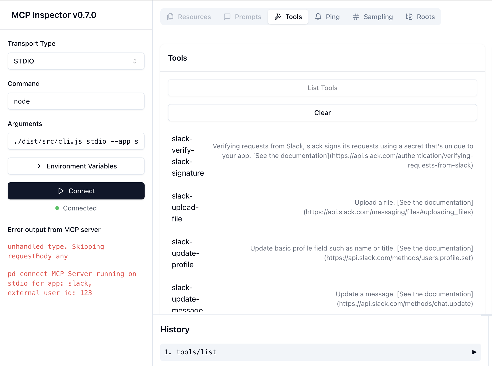

# Pipedream MCP server

Run **your own MCP server** for [over 2,500 apps and APIs](https://pipedream.com/apps).

You can:

- [Run the servers locally](#running-the-server-via-npx) with `npx @pipedream/mcp`
- [Host the servers yourself](#hosting-your-own-server) to use them within your app or company

## ⭐ Features

- Run your own MCP server for over 2,500 apps
- Manage servers **for your users**, in your own app.
- Connect accounts, configure params, and make API requests, all via tools
- Fully-managed OAuth and credential storage ([see security docs](https://pipedream.com/docs/privacy-and-security/#third-party-oauth-grants-api-keys-and-environment-variables))

## 🚀 Getting Started

Pipedream's MCP servers use the [Pipedream Connect API](https://pipedream.com/docs/connect/) to manage auth and make API requests. To run an MCP server, you'll need a Pipedream project and Pipedream API credentials.

1. [Sign up for Pipedream](https://pipedream.com/auth/signup)
2. [Create a project](https://pipedream.com/docs/workflows/projects/#creating-projects). Any accounts connected via MCP will be stored here.
3. [Create a Pipedream OAuth client](https://pipedream.com/docs/rest-api/auth/#creating-an-oauth-client)
4. Set the following environment variables using your preferred method (directly in your shell session, dot files, etc.)

```bash
PIPEDREAM_CLIENT_ID=your_client_id
PIPEDREAM_CLIENT_SECRET=your_client_secret
PIPEDREAM_PROJECT_ID=your_project_id
PIPEDREAM_PROJECT_ENVIRONMENT=development
```

### Pipedream concepts to understand

If you're running MCP servers for your app, you'll likely want to use the [SSE interface](#sse). The SSE server accepts two route params:

1. `external_user_id` — This is your user’s ID, in your system — whatever you use to uniquely identify them. Any requests made to that route are coupled to that end user, and would use the auth Pipedream stores for that user. [See the docs](https://pipedream.com/docs/connect/api/#external-users) for more detail.
2. `app` — The app's "name slug" (the unique identifier for the app), found in the **Authentication** section of [any Pipedream app](https://pipedream.com/apps). For example, the app slug for [Slack](https://pipedream.com/apps/slack) is `slack`.

If your user `123` wants to connect to the `slack` MCP server, your MCP client would make a request to the `/123/slack` route. [See the SSE docs below](#sse) for more detail.

### Running the server via `npx`

Pipedream MCP servers provide [two interfaces](https://modelcontextprotocol.io/docs/concepts/architecture#transport-layer) clients can connect to:

1. **Stdio**: Uses standard input / output. Ideal if you want to connect accounts and make MCP requests from editors and other local MCP clients. Great for testing.
2. **SSE**: Uses [Server-Sent Events](https://developer.mozilla.org/en-US/docs/Web/API/Server-sent_events/Using_server-sent_events) to communicate with clients. Use this when you want to host an internet-facing MCP server that other services / your customers can use.

#### Stdio

First, [set these variables in your environment](#getting-started).

Run the stdio server for a specific app, passing the app's name slug to the `--app` option:

```bash
npx @pipedream/mcp stdio --app slack
```

You can also specify an optional [external user ID](#pipedream-concepts-to-understand) — whatever ID you use to identify your user in your app (otherwise a random UUID will be generated):

```bash
npx @pipedream/mcp stdio --app slack --external-user-id user123
```

#### SSE

First, [set these variables in your environment](#getting-started).

Run the SSE server:

```bash
npx @pipedream/mcp sse
```

This exposes a generic MCP server that allows you to connect to any of our 2,500+ apps by passing [the app's name slug](#pipedream-concepts-to-understand) **directly in the route**:

```console
❯ npx @pipedream/mcp sse
Server is running on port 3010
Routes configured:
- GET / - Health check
- GET /:external_user_id/:app - App-specific SSE connection endpoint
- POST /:external_user_id/:app/messages - App-specific message handler
```

To connect to the server:

1. Connect to `http://localhost:3010/:external_user_id/:app` where:

   - `:external_user_id` is a unique identifier for the session
   - `:app` is the Pipedream app to use (e.g., "slack")

2. The server will establish an SSE connection and register tools for the specified app.

3. To send messages, post to `http://localhost:3010/:external_user_id/:app/messages?sessionId=<sessionId>` where:
   - `<sessionId>` is provided in the response from the initial connection

You can also specify an app and port via CLI:

```bash
npx @pipedream/mcp sse --app slack --port 8080
```

```console
❯ npx @pipedream/mcp sse --app slack --port 8080
Server is running on port 8080
Routes configured:
- GET / - Health check
- GET /:external_user_id/slack - App-specific SSE connection endpoint
- POST /:external_user_id/slack/messages - App-specific message handler
```

## Hosting your own server

### Using the `Dockerfile`

If you have Docker installed locally, you can build and run the container:

```console
> docker build -t pipedream-connect .
> docker run -d --name pd-mcp -p 3010:3010 --env-file .env pipedream-connect:latest
```

This exposes a generic MCP server at [http://localhost:3010/:external_user_id/:app](http://localhost:3010/:external_user_id/:app).

### Step-by-step

The SSE server runs as a Node.js Express app. The implementation is simple and meant to be a reference. You should [add authorization](#authorization) and [customize the app you need](#customization).

Clone the repo and install dependencies:

```bash
npm install
```

[Set these variables in your environment](#getting-started) in using whatever env / secrets store you use in your infra. To test this locally, copy the `.env.example` file:

```bash
cp .env.example .env
```

and fill in the values:

```bash
# Pipedream OAuth credentials
PIPEDREAM_CLIENT_ID=your_client_id
PIPEDREAM_CLIENT_SECRET=your_client_secret

# From the project settings
PIPEDREAM_PROJECT_ID=your_project_id
PIPEDREAM_PROJECT_ENVIRONMENT=development

# Pipedream can send you webhook notifications on account connection, account failure, etc.
PIPEDREAM_WEBHOOK_URI=https://your-webhook.m.pipedream.net

# Optional: Default app to use (defaults to "slack")
APP=slack

# Optional: Port for the SSE server (defaults to 3010)
PORT=3010
```

Run the build:

```bash
npm run build
```

And run the SSE server:

```bash
npm run start:sse:prod
```

## Authorization

MCP recently added support for [servers authorizing requests using OAuth](https://spec.modelcontextprotocol.io/specification/2025-03-26/basic/authorization/). When you host your own server, you should implement OAuth support to protect access to customer data.

## Debugging

First, [set these variables in your environment](#getting-started).

Use [the MCP Inspector](https://modelcontextprotocol.io/docs/tools/inspector) or your preferred MCP client to connect to the server:

```bash
npx @modelcontextprotocol/inspector node ./dist/src/cli.js stdio --app APP --external-user-id USER_ID
```

Open [http://localhost:5173/](http://localhost:5173/) and set the transport type to **STDIO**.



## Customization

You can customize this implementation in any way you'd like, for example:

1. Modifying `config.ts` to change default settings
2. Extending `registerComponentTools.ts` to add additional tools, or limit tools to a fixed set.
3. Improving the implementation to take advantage of [the latest version](https://spec.modelcontextprotocol.io/specification/2025-03-26/) of the MCP spec.
4. Persisting session data in Redis, or whatever data store you use.

## License

Pipedream Source Available License Version 1.0 - See https://github.com/PipedreamHQ/pipedream/blob/master/LICENSE
